<div align="center">

# KAEOS

### The Cognitive Operating System for the Enterprise

**A living Company Brain that understands the entire organization, learns continuously,
simulates the future, orchestrates AI agents, and helps leaders make faster, smarter,
and fully explainable decisions.**

[](LICENSE)
[](https://python.org)
[](https://fastapi.tiangolo.com)
[](https://react.dev)
[](https://typescriptlang.org)
[](backend/tests/e2e/)
[](https://ollama.ai)

<br />

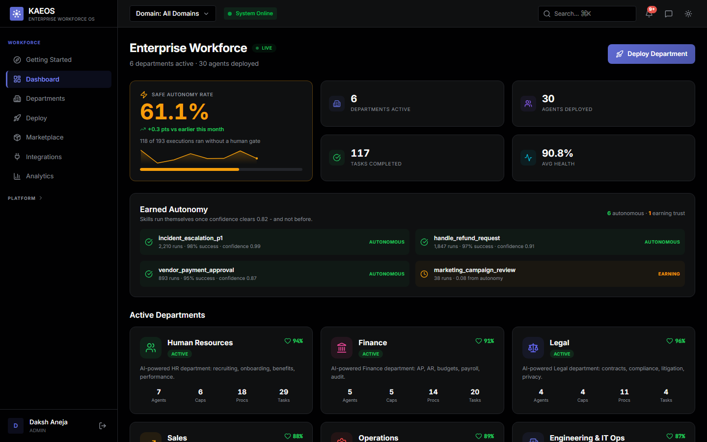

<sub>The workforce dashboard: **safe-autonomy rate** (how much ran without a human gate), live departments,
and skills that have *earned* autonomy. Captured from a running instance against PostgreSQL — a live
app on a seeded demo tenant, not a mockup or a design comp.</sub>

</div>

---

## What is KAEOS?

KAEOS is building the **Cognitive Operating System for the Enterprise**.

Today's enterprises run on dozens of disconnected systems - Workday for HR, SAP for Finance,
Jira for Projects, ServiceNow for IT, Salesforce for Sales. Each system stores data, but none
truly understands how the entire organization works.

KAEOS creates a living **Company Brain** by building a real-time **Enterprise Twin** that models
employees, departments, capabilities, projects, vendors, goals, knowledge, risks, decisions, and
the relationships between them. On top of that twin sits a reasoning layer that predicts the
consequences of change, coordinates autonomous AI agents, and helps organizations make better
decisions **before problems become crises**.

### The Eight Pillars

| Pillar | What it does | Where it lives in KAEOS |
|--------|--------------|-------------------------|
| **Company Brain** | A unified intelligence layer that understands the whole organization instead of isolated departments - rules, skills, signals, and a cross-domain knowledge graph with 5-dimensional confidence scoring | `/brain/overview`, `/rules`, `/skills`, `/topology/graph`, `/elicitation`, `/extraction` |
| **Department Brains** | Specialized AI reasoning engines per business function - HR, Finance, Legal, Sales, Customer Support, Operations (incl. procurement, vendors, QA), and Engineering & IT Ops (code review, deployments, incidents), each with domain agents that run through the gated pipeline | `/hr`, `/finance`, `/legal`, `/sales`, `/support`, `/operations`, `/engineering` |
| **Agent Factory** | Create, approve, compile, deploy, and orchestrate enterprise AI agents that all share the same organizational context - from a plain-English prompt | `/agents/blueprint*`, `/agents/deployed`, `/agents/debates`, `/agents/activity-feed` |
| **Decision Intelligence** | Evaluates business situations, generates options, scores cost / risk / impact, and recommends the best course of action - with adversarial debate before committing | `/reality/shock`, `/reality/decision`, `/simulation/what-if`, `/org-intelligence/*` |
| **Learning Engine** | Learns continuously from decisions and outcomes: confidence decay, Bayesian validation updates, execution feedback (L10), and learning modifiers that improve future recommendations | `/reality/learning`, `ConfidenceEngine`, `FeedbackEngine`, `EvolutionEngine` |
| **Enterprise Simulation** | "What-if" scenarios - **M&A integration, cyber incidents**, talent exodus, vendor/supply-chain failure, system outages, budget cuts, macro shocks. Blast-radius traversal runs over the live twin; the impact-scoring layer is a **parametric simulator over configurable causal archetypes** (tuned profiles, not learned from tenant data) | `/reality/shock`, `/reality/simulate`, `/10x/physics/simulate`, `/simulation/what-if` |
| **Governance & Provenance** | Every recommendation is explainable, traceable, and auditable - a hash-chained (tamper-evident) provenance ledger, fairness audits, red-team checks, and blocking HITL gates. Explainable by design, not a black box | `/provenance`, `/10x/quantum-events`, `/fairness/audit-log`, `/redteam`, `/hitl` |
| **Executive Command Center** | A real-time interface where leaders monitor the enterprise, inject business shocks, visualize downstream impact, and receive actionable recommendations in seconds | `/executive/*`, `/dashboard/cockpit`, `/reality/twin`, Reality Experience UI |

### Our Moonshot

To build a true **Company Brain** - an intelligent reasoning layer that sits above every
enterprise system, understands how the entire business operates, predicts the consequences of
change, coordinates autonomous AI agents, and helps organizations make better decisions before
problems become crises.

### The Problem We Solve

Enterprise AI deployments fail because they require engineers to build every workflow from scratch,
and because each AI tool sees only one silo of the business. KAEOS inverts this model: the system
understands your organization from its signals, structures autonomous agents around your existing
processes, and operates continuously - with full audit trails and human override at every step.

---

## Core Capabilities

### 7 AI-Powered Departments

Deploy any combination of these pre-built AI departments, built on a production-oriented,
security-hardened architecture (RLS-isolated per tenant, gated agent pipeline):

| Department | Agents | Key Automations |
|-----------|--------|-----------------|
| **Human Resources** | 7 | Recruiting pipeline, onboarding, benefits Q&A, performance synthesis, compensation analysis, employee relations, offboarding |
| **Finance** | 5 | AP/AR processing, budget variance analysis, expense review, payroll audit, tax compliance |
| **Legal** | 5 | Contract review, regulatory compliance monitoring, litigation tracking, privacy impact assessment, IP/patent evaluation |
| **Sales** | 6 | Pipeline management, lead scoring, deal forecasting, account intelligence, CPQ discounting, commission payout |
| **Customer Support** | 5 | Ticket classification, SLA enforcement, knowledge base retrieval, escalation routing, CSAT analysis |
| **Operations** | 5 | Project tracking, resource allocation, vendor management, procurement workflows, QA automation |
| **Engineering & IT Ops** | 3 | Code review risk assessment, incident triage with deploy correlation, deployment risk scoring |

**Why Engineering matters most.** Coding is ~55% of enterprise departmental AI spend and IT ops
another ~10% ([Menlo Ventures, 2025 State of GenAI in the Enterprise](https://menlovc.com/perspective/2025-the-state-of-generative-ai-in-the-enterprise/),
survey of 495 enterprise AI decision-makers) - more than every other function combined. The
Engineering department models the service catalog (SLO targets, error budgets, ownership), pull
requests, deployments, incidents, and postmortems, and reports live DORA metrics (change-failure
rate, MTTR) computed from real rows.

Two behaviours are deliberate and enforced by tests:

- **Production deploys never self-approve.** `engineering_deploy_approval` is an always-HITL skill:
  the agent scores risk and produces the evidence, a human approves the release.
- **Incidents may only be blamed on deploys that actually shipped** and that precede detection.
  Without both filters an agent will confidently tell a commander to roll back a release that was
  never deployed.

### 7-Gate Skill Execution Pipeline

Every AI action - regardless of source - is evaluated by the same 7-gate pipeline before execution.
Autonomy is the default: a decision whose confidence clears the threshold passes straight through the
HITL gate and executes without a human. The gate only pauses decisions below the threshold and a set of
high-consequence action classes (e.g. production deploys, customer-facing documents), which always route
to a human:

```
Signal / Trigger
      │
      ▼
  1. Compliance      ← SOX, GDPR, HIPAA, PCI, EEOC, CCPA enforcement
      │
      ▼
  2. Fairness        ← EU AI Act Art.13, demographic bias detection
      │
      ▼
  3. Confidence      ← Threshold check, AMBER/GREEN/RED tier routing
      │
      ▼
  4. HITL            ← Below-threshold + high-consequence actions pause here;
      │                 above-threshold decisions pass through autonomously
      │
      ▼
  5. Debate          ← Adversarial Proposer / Advocate / Arbitrator reasoning
      │
      ▼
  6. Execute         ← LLM execution via tiered BYOK routing (local Ollama → Claude → GPT-4o)
      │
      ▼
  7. Provenance      ← Hash-chained, tamper-evident decision ledger with full lineage
```

### Intelligence Layer

| Engine | Description |
|--------|-------------|
| **PreCog Engine** | Reads external signals (market, regulatory, behavioral) and detects latent intent - triggering zero-prompt autonomous workflows without human input |
| **Enterprise Physics Engine** | Models causal laws across your organization. Runs shock simulations: "What happens to SLA compliance if we lose 3 engineers?" |
| **Genome Compiler** | Encodes your organization as an evolvable genome. Compiles live physics features (workforce stability, capability redundancy, delivery rate, vendor concentration, budget utilization) into trait scores. Live at `GET /genome/state` |
| **Evolution Engine** | Scores enterprise fitness across 9 sub-scores and derives structural optimizations from real weak signals - unverified rules, stopped agents, vendor concentration, recent failures. Live at `GET /evolution/state` |
| **Pattern Discovery Engine** | Mines unstructured signals for hidden workflow opportunities - surfacing automations no one asked for |
| **Digital Twin** | A living, physics-simulated graph of your entire organization - employees, capabilities, projects, vendors, and their relationships. Department territories are hue-coded, energy particles trace signal flow, and injected shocks propagate visibly: an expanding shockwave hits each impacted node in graph-distance order with a physical impulse |

### Bring Your Own Model (BYOK) - the platform adapts to your model

KAEOS is model-agnostic via LiteLLM (OpenAI, Anthropic, Mistral, Groq, Cohere, Azure, self-hosted
Ollama, or any OpenAI-compatible endpoint). But "bring your own model" is a quality lottery unless
the platform knows what your model can actually do. So it measures.

**Configure → probe → the gates adapt:**

```
PUT  /config/llm-routing              # your model + key for a tier (key encrypted at rest)
POST /config/llm-routing/{tier}/probe # calibrate it
GET  /config/llm-routing              # capability profile - never returns the key
```

The probe runs a small battery - JSON compliance, multi-step reasoning, strict instruction
following - and produces a **`tier_ceiling`**: the maximum confidence any decision may claim on that
model. A weaker model earns a lower ceiling, which pushes its decisions below the 0.82 HITL
threshold and routes them to a human **automatically**.

| Tier | Powers |
|------|--------|
| `TIER_1_COMPLEX` | Debates, fairness scoring, blueprint generation, agent reasoning |
| `TIER_2_STANDARD` | Extraction, summarization, explainability |
| `TIER_3_FAST` | Intent routing, formatting, simple operations |
| `TIER_EMBEDDING` | Vector search and retrieval |

Measured example - `phi4-mini` probes at a **0.70 ceiling**: it solves multi-step arithmetic
perfectly (1.0) but fails strict instruction-following (0.0) and wraps JSON in prose (0.75). Put it
on the reasoning tier and an identical high-confidence skill flips from `SUCCESS_CLEAN` to
`PENDING_HITL`. Swap to a stronger model and autonomy returns.

The ceiling is enforced at **Gate 3 of the agent pipeline itself** - every domain agent (finance,
legal, sales, support, operations, engineering) inherits it, not just the `/skills` routes. A weak
model mechanically routes more of the whole platform's decisions to humans.

**Model choice becomes a governance dial, not a gamble.** An unprobed tier imposes no cap, changing
a model invalidates its stale profile, and keys are Fernet-encrypted, write-only, and tenant-scoped.
The local default is `qwen2.5-coder:7b` (strong strict-JSON compliance, fits a 6GB GPU).

### Live Enterprise Integrations (self-service)

Every tenant connects their own systems from the **Integrations** page - no engineering
involvement. Click the key icon on any connector, paste your credentials, test, and sync:

**22 live adapters** across every domain. `GET /connectors/providers` returns the machine-readable
catalog (id, domain, authority weight, PII flag, required config).

| Domain | Provider | Auth | What syncs |
|--------|----------|------|-----------|
| **Engineering** | **GitHub** | Personal access token | Pull requests for a repo |
| | **GitLab** | Private token | Merge requests for a project |
| | **Jira Cloud** | Email + API token | Recently updated issues (JQL-configurable) |
| | **PagerDuty** | API key | Incidents (status-filterable) |
| | **Datadog** | API key + app key | Monitors and their alert state |
| | **Sentry** | Auth token | Unresolved error issues |
| **IT Ops** | **ServiceNow** | Basic auth | Any table - incidents, changes, CMDB |
| **Support** | **Zendesk** | Email + API token | Tickets |
| | **Intercom** | Access token | Conversations |
| **Sales** | **Salesforce** | Connected-app OAuth or access token | Opportunities (SOQL-configurable) |
| | **HubSpot** | Private app token | Deals (any CRM object) |
| **HR** | **Workday** | ISU account (RaaS report URL) | Worker records from any RaaS report |
| | **BambooHR** | API key | Employee directory |
| | **Greenhouse** | Harvest API key | Candidates and pipeline stage |
| **Finance** | **SAP** | OData basic auth or API key | Any OData entity set (invoices, vendors…) |
| | **Stripe** | Secret key | Invoices, charges, any resource |
| **Legal** | **DocuSign** | OAuth token | Envelopes and signature status |
| **Collaboration** | **Slack** | Bot token | Channel history |
| | **Confluence** | Email + API token | Pages by space |
| | **Notion** | Integration token | Pages and databases |
| | **Microsoft Graph** | OAuth token | Mail, Teams, SharePoint |
| **Any** | **Generic REST** | Bearer token / API key / none | Any JSON endpoint |

**Sources are not equally trusted.** Each adapter carries an `authority` weight that flows into
confidence scoring: systems of record (BambooHR 0.95, PagerDuty 0.95, Stripe 0.95) outrank wiki
content (Confluence 0.75) which outranks chat (Slack 0.5). Slack is where decisions get *discussed*;
treating that talk as fact is how a knowledge base fills with confident nonsense. Adapters touching
personal data are flagged `handles_pii`; the ingest pipeline applies PII scrubbing as records are
normalized into Signals. Keeping PII out of *cloud* LLMs is a separate concern with its own controls:
a data-residency mode (`DATA_RESIDENCY` pins inference to a local Ollama-only model and strips every
cloud credential/endpoint) and pre-egress PII scrubbing on outbound LLM calls. Both are live: every
**cloud** LLM call is scrubbed by default — belt-and-suspenders, Presidio NER (names/contextual PII)
plus a deterministic structured backstop that removes email/phone/SSN/credit-card/IP/IBAN even when
Presidio is absent or under-confident — while **local** Ollama calls stay in-region and unscrubbed.
Verified by `tests/test_pii_egress.py`.

Security model:

- **Secrets are write-only.** They are sent once over the authenticated HTTPS channel,
  encrypted at rest (Fernet, keyed from `SECRET_KEY`), and the API only ever returns
  secret **key names** - never values. Nothing sensitive renders back into the UI.
- **Admin-gated and tenant-scoped.** Storing/deleting credentials requires the tenant's
  admin role; credentials are isolated per tenant like all other data.
- **Graceful fallback.** Connectors without credentials keep serving the deterministic
  demo feed, so evaluation environments work with zero setup.

Flow: `PUT /connectors/{id}/credentials` → `POST /connectors/{id}/test` →
`POST /connectors/{id}/connect` → `POST /connectors/{id}/sync` (mode `LIVE`), with every
pulled record normalized into a Signal feeding the Company Brain.

### Safe Autonomy Rate - the metric that matters

Industry data is brutal: only **16%** of enterprise agent deployments are true autonomous agents,
**88%** of agent pilots never reach production, and Gartner projects **>40%** of agentic AI projects
will be cancelled by end-2027. In that market the question isn't "can your agent do the task" - it's
"does your agent survive contact with production."

So KAEOS measures **safe autonomy rate**: the share of work completed without human intervention, at
a fixed error budget, trending over time. It is computed live from real executions - a headline number
at `GET /billing/roi`, and a fully broken-out view at `GET /metrics/safe-autonomy` (the rate, an
explainable fallout breakdown of routed-to-human / overridden / edited / failed, a per-skill split
showing where autonomy leaks, and a daily time-series). It rises as verified rules accumulate - the
compounding loop in one number. In the app it has a dedicated **Safe Autonomy** surface (`/autonomy`)
that surfaces all of the above, live.

**What we deliberately do NOT report:** `hours_saved` and `cost_reduction` return `null`, with a note.
They require a human-baseline duration and a loaded hourly rate per skill - tenant inputs KAEOS
cannot measure. They were previously "computed" by multiplying executions by a hardcoded 0.5 hours
and $50/hour. Invented numbers are worse than absent ones, so they are absent.

### KAEOS Copilot - always-on conversational touchpoint

Every screen carries a persistent copilot dock in the bottom-right corner. Any
authenticated user can open it and ask, in plain language, about their agents,
rules, skills, deployments, or compliance posture. It streams grounded answers
from the platform (never fabricated data) and is read-only, so it is available to
every role. Auth is carried on the user's session token; responses stream over
Server-Sent Events.

### Agent Factory

Build and deploy custom AI agents from natural language:

```
Prompt → Blueprint (DRAFTING) → Approval (APPROVED) → Compile (COMPILED) → Deploy (RUNNING)
```

- Write a plain-English description of what the agent should do
- The system generates a structured blueprint using your org's rules and capabilities  
- Approve, compile (LLM-powered code generation), and deploy with one click
- Deployed agents appear in the live workforce with full observability

### AI Foundry - curating governed activity into training datasets (Phase 2 live; Phase 3 evaluation + gated promotion live; weight fine-tuning is roadmap)

KAEOS v1 is a Company Brain: it understands, reasons over, and acts on enterprise knowledge, and
learns by memory - every conversation adds context, but the underlying model never changes. v2 goes
further: the Company Brain becomes a **factory for AI models**, turning the enterprise's own governed
activity into training data, then (in later phases) fine-tuned, evaluated, and safely deployed
specialist models.

**Phase 2 - Learning Intelligence - is live today** (`/platform/foundry`):

- Every governed decision an agent makes is already a `SkillExecution` - instruction, grounding
  context, reasoning chain, outcome, and human approval. The Foundry curates that history into an
  exportable `{instruction, context, ideal_answer, reasoning, evaluation}` training set.
- Examples are scored by training-signal strength: **Corrected** (a human edited the answer - the
  strongest supervised signal) > **Approved** (a human OK'd it at a gate) > **Gold** (a clean success
  trusted without a human) > **Negative** (blocked/rejected - a contrastive example).
- **Human feedback capture** on any decision (Yes / No / Suggest correction) records the one signal
  executions do not already store: the answer an expert would have preferred.
- Because every example is derived from a governed execution, nothing blocked at the compliance gate,
  or rejected by a human, ever becomes training data - the dataset inherits the platform's governance.
- One-click **Build Dataset** (idempotent mining) and **Export JSONL** ready for the Phase 3
  fine-tuning pipeline. Everything is tenant-scoped and RLS-isolated.

**Phase 3 - Model Evolution - the evaluation-and-gated-promotion loop is live** (`/foundry/evolution/*`):

- Bring a **candidate** model (a stronger model, or one fine-tuned externally on the Phase-2 export)
  and KAEOS **measures** it against the tenant's current model on a **held-out slice of that tenant's
  own governed examples** — real generations, deterministic scoring (exact-match + token-F1), a
  reproducible hashed eval set. No LLM-judges-itself, no invented numbers.
- If evaluation runs **without a live provider**, the run is flagged `simulated` and **can never win
  or be promoted** — a fabricated score must never drive a model swap.
- A win is recorded but **never auto-applied**. Promotion is a separate, **admin-gated** action that
  rewrites the tenant's BYOK routing and forces a re-probe, so the confidence-ceiling gate re-derives
  itself for the new model — the same gated-deploy discipline the rest of the platform uses.
- **What Phase 3 deliberately does NOT do:** train weights. The actual fine-tune step is
  external/pluggable (submit the JSONL to a provider, bring the resulting model id back as the
  candidate). Shipping a fake trainer would violate the platform's honesty, so it is absent by design.
  Verified by `tests/test_model_evolution.py`.

The five-phase roadmap (1: Company Brain - done; 2: Learning Intelligence - live; 3: Model Evolution -
evaluation + gated promotion live, weight training external/roadmap; 4: Specialized Models;
5: Autonomous Foundry) is shown honestly in-product, and every future model
stays gated by the same 7-gate evaluation, safety checks, and human oversight before deployment.

### Client Onboarding - provision a tenant, hand off a secure login

A guided, frontend-driven flow stands up a new client entirely through the product:

- **Admin control tower + wizard** (`/platform/onboarding`, admin-only): a platform operator enters
  the admin secret (held only in the browser tab, sent as a header, never stored), provisions a new
  tenant, and creates its first admin login, ending in a one-time secure handoff card (sign-in URL,
  admin email, temporary password, tenant id). The operator only provisions and creates the first
  login - the client self-serves everything else, so the operator never touches client data (RLS
  enforces it).
- **Client Getting Started** (`/getting-started`): the new client signs in and follows a live
  checklist computed from real tenant state - connect a data source, deploy a department, run a first
  governed decision, configure their model, invite their team, and watch their AI training dataset
  grow.

---

## Screenshots

All captured from a running instance against PostgreSQL — a live app on a seeded demo tenant.

### Reality Experience — live enterprise twin, shock simulation, decision provenance
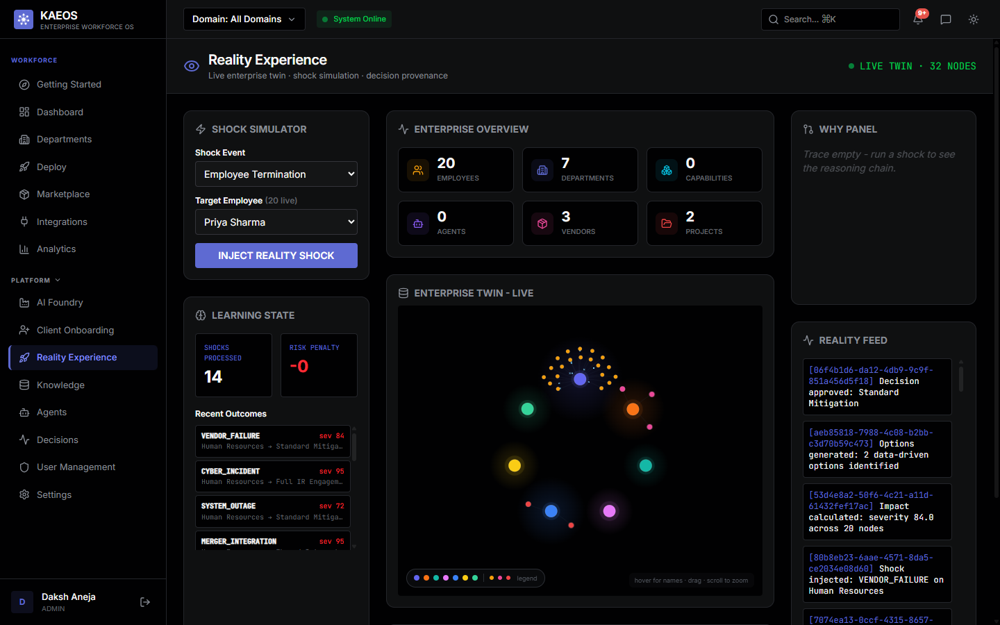
<sub>Inject a shock (termination, vendor failure, cyber incident) and watch it propagate across the live
twin, with the reasoning chain and a provenance feed of every decision.</sub>

### AI Foundry — and an honest roadmap, shown in-product
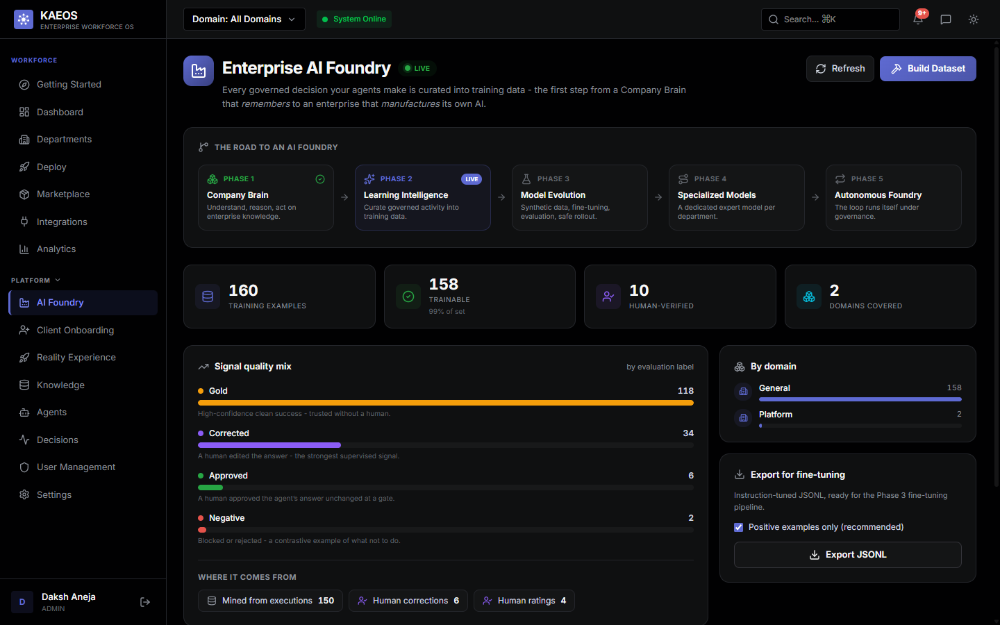
<sub>Governed decisions are curated into training data. Note the phase strip: **Phase 2 is LIVE**;
model fine-tuning (Phase 3+) is roadmap and the product says so. Signal quality is broken out by
how each example was earned — gold, human-corrected, approved, or negative.</sub>

### Executive Cockpit — governance in motion
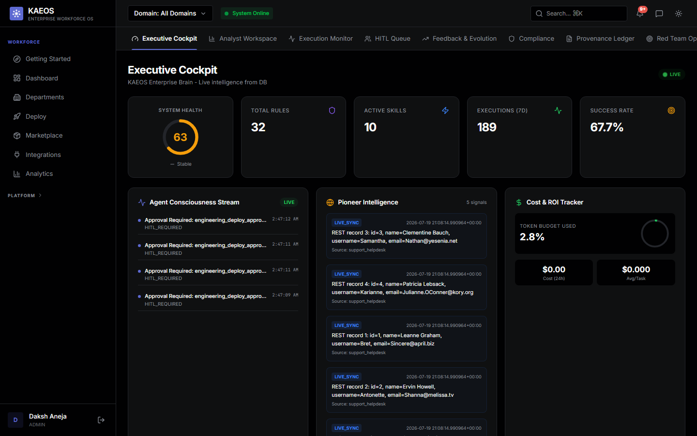
<sub>System health, rules, executions and success rate — with the agent stream showing
`HITL_REQUIRED` approvals: agents that hit the confidence gate and stopped for a human.</sub>

### Skills Registry — confidence, decay, and compliance tags
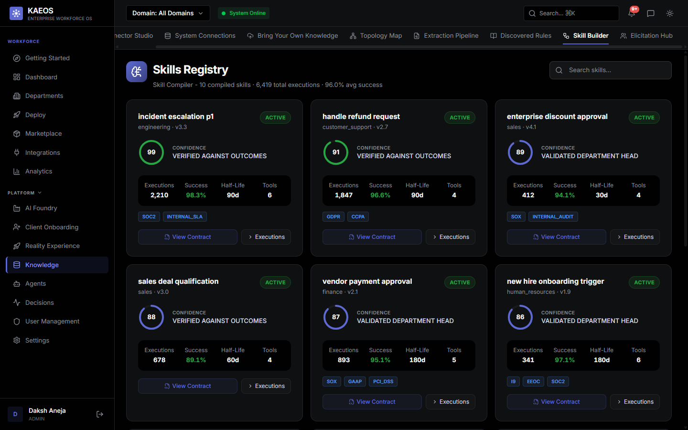
<sub>Every compiled skill carries a confidence score, how it was validated, a half-life (confidence
decays), the tools it may call, and its compliance tags (SOC2, GDPR, SOX, PCI-DSS…).</sub>

### Knowledge Graph — how every workflow connects to the rules that govern it
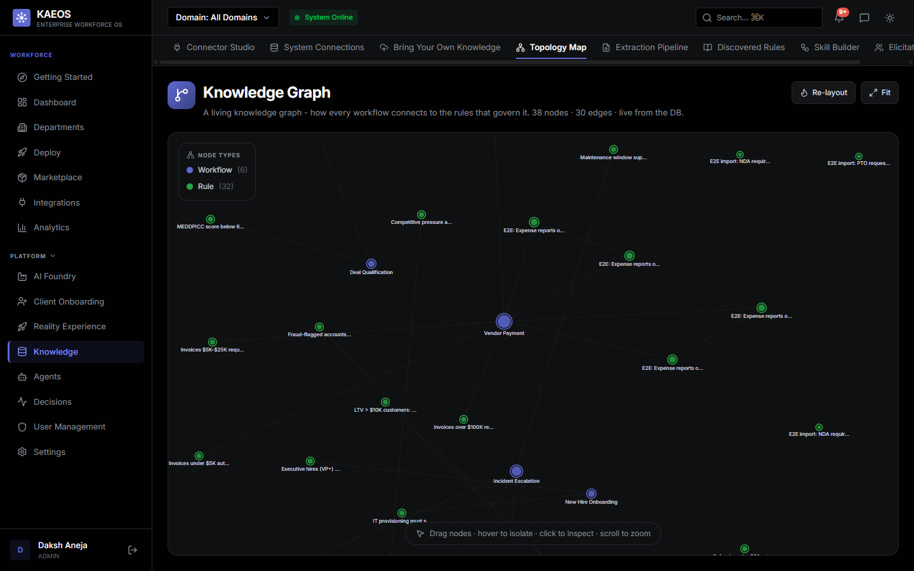
<sub>Live from the database: workflows wired to the rules that constrain them — the cross-domain
graph the Company Brain reasons over.</sub>

### Knowledge Capture — eliciting the unwritten rules
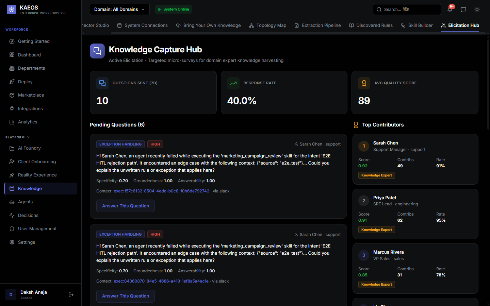
<sub>When an agent hits an edge case, KAEOS asks the right human a targeted question and folds the
answer back into the Company Brain — scored for specificity, groundedness and answerability.</sub>

### Pre-built connectors — 22 live adapters
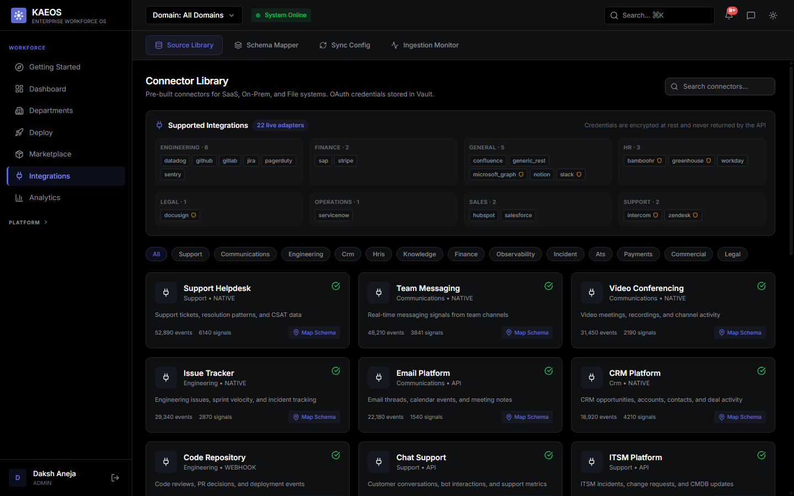
<sub>Connectors across Engineering, Finance, HR, Legal, Sales, Support and Operations. Credentials
are encrypted at rest and never returned by the API.</sub>

### The seven AI departments
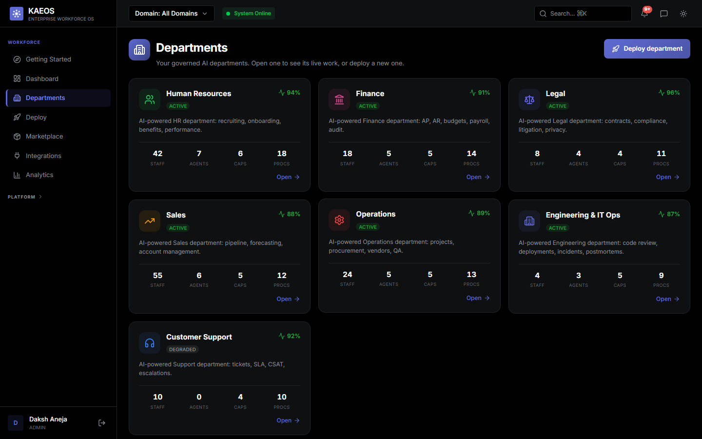

### Department-as-a-Service — deploy a governed department in four steps
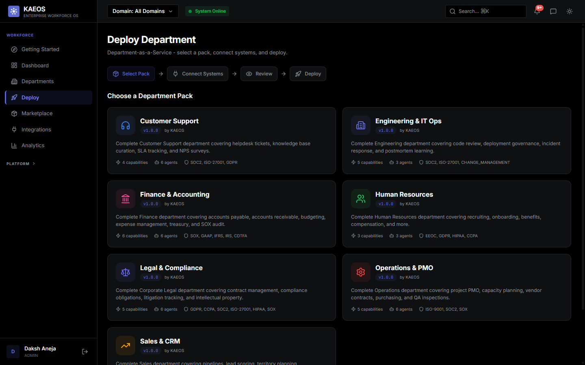
<sub>Pick a pack, connect systems, review, deploy. Each pack ships its capabilities, agents, and the
compliance frameworks it's built against (SOX, GDPR, HIPAA, ISO-27001, EEOC…).</sub>

### Department depth — Finance
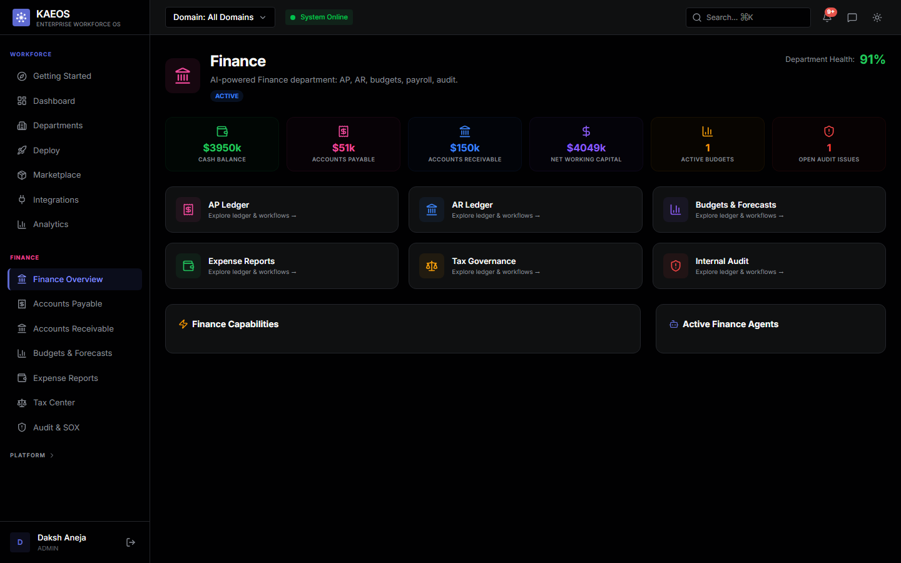
<sub>Each department has its own ledgers, workflows and agents; the sidebar expands into the
department's own sub-navigation.</sub>

### Agent Factory — build an agent from plain language
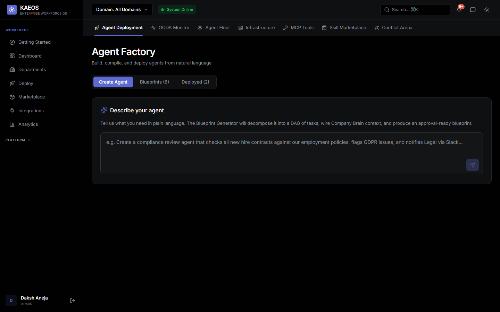
<sub>Describe what you need; the Blueprint Generator decomposes it into a task DAG, wires Company
Brain context, and produces an approval-ready blueprint.</sub>

### Getting started
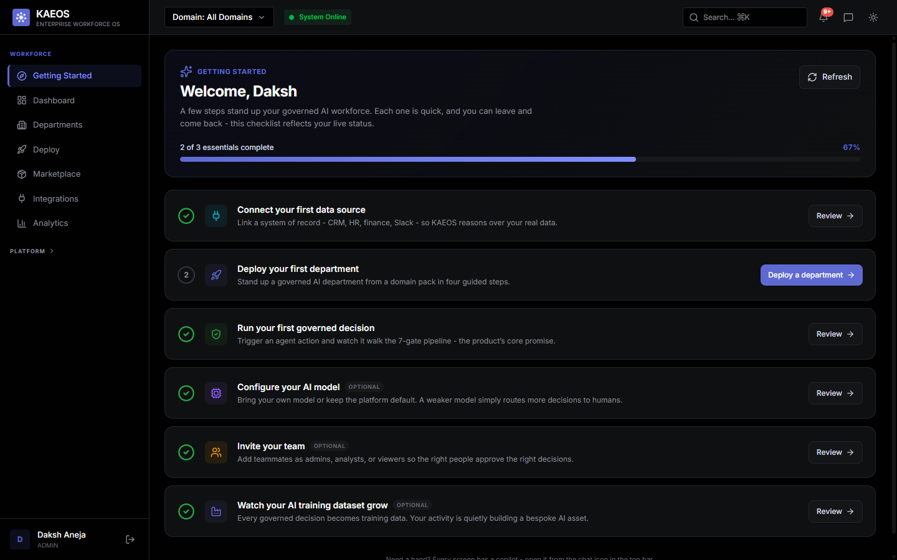

---

## Architecture

```
┌──────────────────────────────────────────────────────────────────────┐
│                         KAEOS Frontend                               │
│   React 19 · TypeScript · 40 Pages · 7 Department Views             │
│   Real-time WebSocket · SSE Streaming · Tailwind CSS                 │
└──────────────────────────────────┬───────────────────────────────────┘
                                   │  REST + WebSocket + SSE
┌──────────────────────────────────▼───────────────────────────────────┐
│                    FastAPI Backend  (Python 3.12+)                   │
│                                                                      │
│  ┌─────────────┐  ┌─────────────┐  ┌─────────────┐  ┌───────────┐  │
│  │ Auth / RBAC │  │  EventBus   │  │  WebSocket  │  │  Scheduler│  │
│  │ JWT · API   │  │  Redis      │  │  Manager    │  │ APScheduler│  │
│  │ Keys · SAML │  │  Pub/Sub    │  │  Multi-     │  │ Decay loop│  │
│  └─────────────┘  └─────────────┘  │  tenant     │  └───────────┘  │
│                                    └─────────────┘                  │
│  ┌───────────────────────────────────────────────────────────────┐  │
│  │             7-Gate Skill Execution Pipeline                   │  │
│  │  Compliance → Fairness → Confidence → HITL → Debate →        │  │
│  │  Execute (LiteLLM 4-tier + Ollama local) → Provenance Ledger │  │
│  └───────────────────────────────────────────────────────────────┘  │
│                                                                      │
│  ┌─────────────┐  ┌─────────────┐  ┌─────────────┐  ┌───────────┐  │
│  │  PreCog     │  │  Physics    │  │  Genome     │  │  Pattern  │  │
│  │  Engine     │  │  Engine     │  │  Compiler   │  │  Discovery│  │
│  └─────────────┘  └─────────────┘  └─────────────┘  └───────────┘  │
│                                                                      │
│  ┌─────────────────────────────────────────────────────────────┐    │
│  │                   Workforce Layer                           │    │
│  │  11-State FSM · Domain Pack Marketplace · DepartmentRuntime │    │
│  │  Agent Factory · Blueprint State Machine · WorkforceGen     │    │
│  └─────────────────────────────────────────────────────────────┘    │
└──────────────────────────────────┬───────────────────────────────────┘
                                   │
┌──────────────────────────────────▼───────────────────────────────────┐
│                         Polystore                                    │
│   PostgreSQL + pgvector  │  Redis  │  Neo4j  │  SQLite (dev)         │
└──────────────────────────────────────────────────────────────────────┘
```

---

## Quick Start

### Prerequisites

- Docker 24+ and Docker Compose v2
- An LLM API key (Anthropic Claude **or** OpenAI GPT-4) - **or** [Ollama](https://ollama.ai) for fully local inference
- 4GB RAM minimum (8GB recommended)

### 1. Clone and configure

```bash
git clone https://github.com/Daksh-Aneja-Projects/KAEOS.git
cd KAEOS
cp .env.example .env
```

Open `.env` and set at minimum:

Pick one of two modes:

```env
# Mode A: local/dev (zero external services, auth + tenant isolation OFF).
# Uses SQLite + in-memory cache; simplest way to try KAEOS locally.
# BOTH lines are required: DEV_MODE disables auth, so ENVIRONMENT must be
# explicitly set to a known-local value (development, dev, local, test,
# testing, ci) or the app refuses to boot.
DEV_MODE=true
ENVIRONMENT=development

# Mode B: production-like (Postgres + RLS, auth ON).
# Leave DEV_MODE unset (or false). DEV_MODE=true is REFUSED unless ENVIRONMENT
# is explicitly one of the known-local values above — an unset ENVIRONMENT or
# anything else (staging, production, typos) fails closed, so it can never
# leak into a real deploy.

SECRET_KEY=<generate with: python -c "import secrets; print(secrets.token_urlsafe(32))">
ADMIN_SECRET=<a second unique secret - guards the admin endpoints>
ANTHROPIC_API_KEY=sk-ant-...   # or OPENAI_API_KEY=sk-...
# For fully-local inference (no cloud keys needed):
# OLLAMA_BASE_URL=http://localhost:11434

# Your first admin login — provisioned automatically on startup.
# There is NO default public login; pick your own here.
ADMIN_EMAIL=admin@yourco.com
ADMIN_PASSWORD=<a strong password — this is how you sign in>
```

> **First login.** After the stack is up, sign in at the frontend with the
> `ADMIN_EMAIL` / `ADMIN_PASSWORD` you set above. Leaving `ADMIN_PASSWORD` empty
> (outside `DEV_MODE`) means no admin is seeded — a deliberate choice so a public
> deployment never ships with known credentials.

> Outside `DEV_MODE=true` the backend **refuses to boot** until both `SECRET_KEY`
> and `ADMIN_SECRET` are set to real values - a default secret is a security
> incident waiting to happen, so it fails fast instead.

> **Zero-dependency dev stack.** KAEOS runs with **no external services** for local
> development: set `DEV_MODE=true` in `.env` and it uses SQLite (relational + vector +
> graph via the polystore) and an in-memory cache/pub-sub. When no LLM provider key is
> configured the system routes to Ollama (if running) or returns deterministic simulated
> responses. In production, provide a PostgreSQL `DATABASE_URL` (**`pgvector/pgvector:pg16`
> image** - plain Postgres lacks the `vector` type), Redis, and optionally Neo4j - the
> polystore selects those backends automatically.
>
> **Hard guard:** `DEV_MODE=true` disables auth and tenant isolation, so the backend
> **refuses to boot** unless `ENVIRONMENT` is explicitly set to a known-local value
> (`development`, `dev`, `local`, `test`, `testing`, `ci`). Unset or anything else
> — including `staging`, `production`, and typos — fails closed.

### 2. Start all services

```bash
docker compose up --build
```

| Service | URL |
|---------|-----|
| Frontend (containerized, Nginx) | http://localhost:5174 |
| Frontend (local dev, `npm run dev`) | http://localhost:5173 |
| Backend API | http://localhost:8001 |
| API Docs (Swagger) | http://localhost:8001/docs |
| Prometheus | http://localhost:9090 |
| Grafana | http://localhost:3000 |

### 3. Login

Sign in with the admin account you configured in `.env` — the `ADMIN_EMAIL` /
`ADMIN_PASSWORD` you set in step 1. It's provisioned automatically on first
startup. There is **no** default/shared login: if `ADMIN_PASSWORD` is empty
(outside `DEV_MODE`), no admin is seeded, by design.

### 4. Seed demo data (usually automatic)

The stack **auto-seeds on startup** (`SEED_DEMO_DATA=true`, the default), so after step 2 the
7 departments are already populated. Set `SEED_DEMO_DATA=false` if you want an empty tenant that
reflects only genuinely ingested data.

To (re)run the seeder manually, run it **inside the backend container** so it targets the same
database the app uses (running it on your host hits a different DB, e.g. a local SQLite file):

```bash
docker compose exec backend python -m scripts.seed_master
```

This seeds all 7 departments - HR, Finance, Legal, Sales, Support, Operations, **Engineering & IT Ops** -
plus the Agent Factory, external-intelligence signals, and infrastructure (model registry, prompts,
cost governor). Takes ~30 seconds. It is idempotent: re-running tops up anything added since your
tenant was first seeded (new connectors, new departments) without duplicating existing rows.

### 5. Deploy your first AI Department

1. Navigate to **Workforce** in the sidebar
2. Click **Deploy Department**
3. Select **Human Resources** domain pack
4. Connect your data sources (or use the built-in demo data)
5. Click **Deploy** - the 11-state FSM provisions your AI department automatically

---

## Project Structure

```
kaeos/
├── backend/
│   ├── app/
│   │   ├── api/
│   │   │   └── routes/              # 34+ FastAPI route files
│   │   ├── core/
│   │   │   ├── auth.py              # JWT + API key auth
│   │   │   ├── config.py            # Settings (DEV_MODE, secret validation)
│   │   │   ├── seed.py              # Startup seeder (skills, rules, departments)
│   │   │   ├── middleware.py        # Rate limiting, tenant isolation, CORS
│   │   │   ├── database.py          # Async SQLAlchemy setup
│   │   │   └── polystore/           # Dual-mode: VectorStore · GraphStore · CacheBus
│   │   ├── models/
│   │   │   ├── domain.py            # Core domain models (Skill, Rule, Execution, Signal...)
│   │   │   └── events.py            # SystemEvent, WebhookSubscription
│   │   ├── services/
│   │   │   ├── skill_executor.py    # 7-gate pipeline
│   │   │   ├── hitl_manager.py      # HITL: DB is source of truth; Redis/memory cache carries resume payloads
│   │   │   ├── event_bus.py         # EventBus + WebSocket broadcast
│   │   │   ├── llm_router.py        # LiteLLM routing, per-tenant BYOK, capability ceiling
│   │   │   ├── model_probe.py       # BYOK self-calibration battery
│   │   │   ├── json_utils.py        # Tolerant LLM JSON parsing (use everywhere)
│   │   │   ├── live_connectors.py   # Credentialed live sync + encryption
│   │   │   ├── vendor_adapters.py   # vendor adapters (17 here + 5 core in live_connectors = 22 total)
│   │   │   ├── precog_engine.py     # Zero-prompt ambient intelligence
│   │   │   ├── enterprise_physics_engine.py
│   │   │   ├── genome_compiler.py
│   │   │   └── pattern_discovery_engine.py
│   │   ├── workforce/
│   │   │   ├── api/                 # Departments, deployment, packs, processes
│   │   │   ├── deployment/
│   │   │   │   ├── state_machine.py # 11-state FSM
│   │   │   │   ├── studio.py        # Deployment pipeline owner
│   │   │   │   └── integration_mapper.py
│   │   │   ├── domain_packs/packs/  # hr.yaml, finance.yaml, legal.yaml...
│   │   │   └── runtime/
│   │   │       └── department_runtime.py
│   │   ├── hr/                      # HR vertical (14 models, 7 agents, full API)
│   │   ├── finance/                 # Finance vertical
│   │   ├── legal/                   # Legal vertical
│   │   ├── sales/                   # Sales vertical
│   │   ├── support/                 # Support vertical
│   │   ├── operations/              # Operations vertical
│   │   └── engineering/             # Engineering & IT Ops vertical
│   │       ├── models/              # core (services, engineers), delivery (PRs, deploys), incidents
│   │       ├── agents/              # code_review, incident, deploy_risk (+ gated_runner)
│   │       ├── api/v1/router.py
│   │       └── seed.py
│   ├── scripts/
│   │   ├── seed_master.py           # Master seeder - the only entry point you need
│   │   ├── seed_agent_factory.py    # Agent Factory blueprints + agents
│   │   ├── seed_infrastructure.py   # Model registry, prompts, cost governor
│   │   ├── seed_integrations.py     # External intelligence signals
│   │   ├── security_audit.py        # Security posture audit
│   │   └── load_test.py             # Load/perf harness
│   ├── tests/
│   │   ├── e2e/                     # 426-test E2E suite (live backend + real Ollama)
│   │   │   ├── conftest.py          # Shared fixtures (httpx client, has_ollama)
│   │   │   ├── test_01_company_brain.py
│   │   │   ├── test_02_hr_department.py
│   │   │   ├── test_03_finance_department.py
│   │   │   ├── test_04_legal_department.py
│   │   │   ├── test_05_sales_department.py
│   │   │   ├── test_06_support_department.py
│   │   │   ├── test_07_operations_department.py
│   │   │   ├── test_08_cross_functional.py
│   │   │   ├── test_09_agent_factory.py
│   │   │   ├── test_10_infrastructure.py
│   │   │   ├── test_11_executive_layer.py
│   │   │   ├── test_12_connectors_integrations.py
│   │   │   ├── test_13_auth_rbac.py
│   │   │   ├── test_14_skills_pipeline.py
│   │   │   ├── test_15_rules_lifecycle.py
│   │   │   ├── test_16_advanced_intelligence.py
│   │   │   ├── test_17_platform_infrastructure.py
│   │   │   ├── test_18_workforce_billing.py
│   │   │   ├── test_19_governance_operations.py
│   │   │   ├── test_20_domain_deep_actions.py
│   │   │   ├── test_21_live_connectors.py
│   │   │   ├── test_22_shock_scenarios.py
│   │   │   ├── test_23_coverage_gaps.py       # route gaps: HITL pairs, provenance, WS, admin keys
│   │   │   ├── test_24_byok_adaptive.py       # model probe -> ceiling -> gate adaptation
│   │   │   ├── test_25_engineering_department.py
│   │   │   ├── test_26_billing_reality_truth.py  # derived-not-fabricated regressions
│   │   │   ├── test_27_integration_catalog.py    # 22 adapters, graceful failure
│   │   │   ├── test_28_cross_tenant_denial.py    # RLS cross-tenant isolation proofs
│   │   │   └── test_29_foundry_learning.py       # AI Foundry training-dataset layer
│   ├── requirements.txt
│   ├── Dockerfile
│   └── pytest.ini
├── frontend/
│   ├── src/
│   │   ├── pages/                   # 40 page components (most lazy-loaded by views/)
│   │   ├── views/                   # 7 department view composites
│   │   ├── hooks/                   # useWebSocket, useAuth, useTheme
│   │   ├── api/client.ts            # Typed API client (50+ methods)
│   │   └── context/                 # AuthContext, ThemeContext
│   ├── Dockerfile
│   ├── package.json
│   └── vite.config.ts
├── .env.example                     # All env vars documented
├── .gitignore
├── docker-compose.yml               # Full stack: API + DB + Redis + Prometheus + Grafana
├── prometheus.yml
├── CONTRIBUTING.md
├── CODE_OF_CONDUCT.md
├── SECURITY.md
└── LICENSE
```

---

## API Reference

All endpoints are documented at `http://localhost:8001/docs` (Swagger UI).

### Department APIs (all require `X-Tenant-ID` or JWT)

| Department | Prefix | Key Endpoints |
|-----------|--------|---------------|
| HR | `/hr` | `/employees`, `/requisitions`, `/candidates`, `/time-off-requests`, `/performance-reviews` |
| Finance | `/finance` | `/invoices`, `/vendors`, `/budgets`, `/forecasts`, `/tax/filings`, `/sox-controls` |
| Legal | `/legal` | `/matters`, `/contracts`, `/compliance/obligations`, `/cases`, `/privacy/dsars` |
| Sales | `/sales` | `/leads`, `/accounts`, `/opportunities`, `/forecasts` |
| Support | `/support` | `/tickets`, `/kb/articles`, `/csat/surveys`, `/sla/metrics` |
| Operations | `/operations` | `/projects`, `/resources`, `/vendors`, `/procurements`, `/inspections` |
| Engineering | `/engineering` | `/services`, `/engineers`, `/pull-requests`, `/deployments`, `/incidents`, `/postmortems`, `/dashboard` |

Each department exposes gated AI agent actions - **every action route runs the full 7-gate
pipeline** (the ungated shortcut agents were removed), e.g.
`POST /engineering/pull-requests/{id}/review`, `POST /engineering/incidents/{id}/triage`,
`POST /engineering/deployments/{id}/assess` (always-HITL),
`POST /sales/opportunities/{id}/proposal` (always-HITL - customer documents never ship unreviewed),
`POST /support/tickets/{id}/auto-resolve` (always-HITL - customer responses get human review),
`POST /sales/accounts/{id}/churn-risk`, `POST /legal/contracts/{id}/review` (0.75 confidence -
pauses for approval; approving in the HITL queue resumes and executes it).

### Platform APIs

| Category | Prefix | Description |
|----------|--------|-------------|
| Auth | `/auth` | Login, user management, API key creation/revocation |
| Workforce | `/workforce` | Department mgmt, deployment, analytics, packs |
| Rules | `/rules` | Knowledge rules CRUD, validation, decay, provenance |
| Skills | `/skills` | Skill management, execution, confidence tracking |
| HITL | `/skills/hitl` + `/hitl` | ONE queue: `/skills/hitl/pending` lists every pending approval (incl. Gate-3 pipeline pauses, `route_type: GATED_AGENT`); approving a gate pause RESUMES the paused skill |
| Agents | `/agents` | `/blueprints`, `/deployed`, `/activity-feed`, `/debates/recent` |
| Executive | `/executive` | `/overview`, `/health`, `/predictions`, `/trust`, `/story` |
| Reality | `/reality` | `/twin` (org graph), `/shock`, `/provenance`, `/learning`, `/decision` - feed and shock outcomes are persisted and tenant-scoped; learning modifiers are derived from recorded severity, not hardcoded |
| Genome | `/genome` | `/state` - live trait scores compiled from real physics features |
| Evolution | `/evolution` | `/state` - enterprise fitness, 9 sub-scores, derived optimizations |
| BYOK Config | `/config` | `/llm-routing` (GET/POST/DELETE), `/llm-routing/{tier}/probe`, `/mcp-tools`, `/ontology`, `/federated` |
| Billing | `/billing` | `/usage` (token metering + per-tier/model attribution), `/roi` (**safe autonomy rate**) |
| AI Foundry | `/foundry` | `/feedback`, `/datasets/build`, `/datasets`, `/datasets/export` (Phase 2); `/evolution/evaluate`, `/evolution/runs`, `/evolution/runs/{id}/promote` (Phase 3 — gated) |
| Privacy | `/privacy` | `/erasure` (GDPR Art.17, admin), `/retention` (GET/PUT), `/retention/apply` (configurable retention windows) |
| Infrastructure | `/infrastructure` | `/models`, `/prompts`, `/cost/telemetry`, `/agents/registry` |
| Pipeline | `/pipeline` | `/llm/providers`, `/connectors/available`, `/transforms/available`, `/run` |
| Dashboard | `/dashboard` | `/health`, `/cockpit`, `/ooda-events`, `/compliance` |
| Reports | `/reports` | `/health`, `/compliance` |
| Connectors | `/connectors` | `/providers` (catalog of all 22 live adapters), list, health, feed, sync, credentials, schema-map |
| Extraction | `/extraction` | `/signals`, `/candidates` |
| Events | `/events` | `/log` - system event stream |
| Webhooks | `/webhooks` | Webhook subscription management |
| Conflicts | `/conflicts` | Cross-domain rule conflict arena |
| Marketplace | `/marketplace` | Domain pack & skill marketplace |
| Search | `/search` | Global full-text search |
| Chat | `/chat` | SSE streaming chat with context-aware agents |
| WebSocket | `/ws/{tenant_id}` | Real-time event feed |

---

## Testing

### Real-Data Benchmark (validation on real enterprise datasets)

KAEOS's decision logic is scored against **real, human-authored enterprise data** - not
synthetic seed. Seven public datasets (IBM HR attrition, a real ServiceNow incident log,
customer support tickets, sales lead conversion, procurement POs, IBM accounts-receivable
late-payment histories, and CUAD v1's 510 expert-annotated SEC contracts) are mapped to
KAEOS domains - one per department - and its classifiers are measured against the recorded
human outcomes.

```bash
cd backend && python -m benchmark.real_data.run --limit 5000   # writes benchmark/REAL_DATA_BENCHMARK.md
```

Headline results (deterministic path - the rule-based safety net, no LLM):

| Domain | Real dataset | Result |
|--------|-------------|--------|
| **Engineering** | ServiceNow incident log (141k events) | **100% match to the instance's own ITIL priority** - a deterministic impact×urgency identity, i.e. a sanity check that we implement the rule correctly, **not** a predictive-accuracy claim |
| **Finance** | IBM AR late-payment histories (2,466 settled invoices) | **81% accuracy vs 64% baseline** - payment history + dispute status predicts late settlement, with calibrated confidence |
| **HR** | IBM attrition (1,470 employees) | **72% balanced accuracy** on a rare (16%) event - catches flight risk without flooding the queue |
| **Legal** | CUAD v1 (9,358 expert-labelled clause spans, 36 categories) | **39% deterministic-exact** (chance ≈3%) - unmistakable clauses classify instantly; the rest route to a human, which is the HITL contract working |
| Sales / Support / Ops | LeadForge / support tickets / procurement | Reported honestly, incl. two datasets whose labels carry **no learnable signal** (documented, not hidden) |

Not every domain beats its baseline: on these datasets some domains (notably HR, Sales, and
Support) land at or below the naive baseline rather than above it, and those results are reported
transparently - not spun as wins - in the underlying `benchmark/REAL_DATA_BENCHMARK.md` report.

The benchmark is repeatable and committed; raw datasets are gitignored (licensed) with their Kaggle
refs recorded for reproduction. This **replaces** the previous `benchmark_reports/*.json`, which held
fabricated numbers with no dataset behind them.

**Onboard a real company:** `python -m scripts.onboard_real_company` loads all seven datasets into a
single second tenant (`tenant_realco`, "RealCo, Inc.") - real employees, tickets, incidents, leads,
POs, AR invoices with actual settle dates (so aging/DSO figures are computed from history, not
invented), and SEC-filed contracts with expert-labelled, risk-graded clauses. Every record also
becomes a Signal into the Company Brain. View with header `X-Tenant-ID: tenant_realco`. This is the
client-onboarding scenario end to end, and it has caught real bugs the synthetic seed never could -
a severity-downgrade bug, and a cross-tenant leak in the signals feed.

**Agent grounding validation:** every domain agent loads the real entity (ticket text, contract
terms, budget numbers, case facts) into its LLM context before reasoning - an audit found 22 agents
passing only opaque IDs, which left the model classifying an identifier instead of content. All are
now grounded, and `python scripts/validate_domain_agents.py` runs each one through its full gated
pipeline against real rows, verifying both the outcome and that the entity's actual content reached
the model (report: `benchmark/agent_validation_report.json`).

### E2E Test Suite (426 tests across 29 files, live backend + real Ollama)

The full E2E suite exercises every functional surface against a running backend with real
seeded data - all 7 department brains and their AI agents, the 7-gate skill pipeline
(compliance / confidence / HITL gates), the full rule lifecycle (create → validate → clone →
export/import → simulate), auth & RBAC, the Agent Factory lifecycle, predictive / polymorphic /
federated / physics engines, platform config, cost governor & agent protocol, workforce
deployments & domain packs, webhooks, calendar, conflicts, and the executive layer.
LLM-dependent tests use a local Ollama instance (`qwen2.5-coder:7b` model) - no cloud keys needed.

```bash
# 1. Start the backend
cd backend
python -m uvicorn app.main:app --port 8001 --log-level warning

# 2. Seed all data (separate terminal, from backend/)
python -m scripts.seed_master

# 3. Start Ollama (for LLM-dependent tests)
ollama pull qwen2.5-coder:7b

# 4. Run full E2E suite
python -m pytest tests/e2e/ -v --tb=short

# No model at all? The deterministic fake-LLM lane covers the gate/pipeline
# logic (this is what CI runs; ~17 min for the whole suite):
#   KAEOS_FAKE_LLM=1 DEV_MODE=true ENVIRONMENT=ci python -m uvicorn app.main:app --port 8001 &
#   pytest tests/e2e -m "not ollama" -q

# Run a single test file
python -m pytest tests/e2e/test_02_hr_department.py -v

# Run tests that don't need Ollama (fast, no LLM calls)
python -m pytest tests/e2e/ -v -m "not ollama"
```

**Current status:** the end-to-end suite (426 tests) passes against both SQLite (local dev)
and **PostgreSQL 16 + pgvector** (the production data stack) with row-level security enforced.
CI runs the non-Ollama suite against Postgres+pgvector, so a bug SQLite silently tolerates is
caught automatically (this is real: a `NUMERIC`-returns-`Decimal` bug that passed on SQLite was
found and fixed exactly this way). Exact pass counts are run-dependent - a few tests exercise a
live LLM whose availability and output vary. On a fresh Postgres deploy the app self-bootstraps:
`init_db` creates the non-owner `kaeos_app` role, installs RLS on every tenant table, and
`assert_rls_effective` refuses to serve traffic if isolation isn't actually in force.

### Unit Tests

```bash
cd backend
pytest tests/ -v --tb=short --ignore=tests/e2e
```

---

## Multi-Tenancy

KAEOS is fully multi-tenant from the ground up, enforced at **two independent layers**:

**1. Application filters.** Every API request is authenticated via JWT. The `TenantMiddleware`
extracts `tenant_id` from the verified token and injects it into request state via
`Depends(get_tenant_id)`; queries filter on it explicitly.

```python
# Every route endpoint looks like this:
@router.get("/departments")
async def list_departments(
    tenant_id: str = Depends(get_tenant_id),  # Enforced on every request
    db: AsyncSession = Depends(get_db),
):
    result = await db.execute(
        select(Department).where(Department.tenant_id == tenant_id)
    )
```

**2. Postgres Row-Level Security (the backstop that doesn't depend on discipline).** A
hand-written filter can be forgotten - and has been. Under Postgres, every tenant-scoped
table carries a `tenant_isolation` policy comparing `tenant_id` to the transaction-bound
`app.tenant_id` setting: the database itself refuses to return another tenant's rows, even
to a deliberately unfiltered `SELECT *`. An unset tenant context matches **nothing** (fails
closed). The application connects as the non-owner `kaeos_app` role - Postgres exempts
table owners from their own policies, so the compose files deliberately split the app
connection from the owner (migrations/seeding) connection.

Verify on any deployment:

```bash
DATABASE_URL=<kaeos_app url> KAEOS_OWNER_DB_URL=<owner url> python scripts/verify_rls.py
# → RLS ENFORCED
```

SQLite (local dev) has no RLS; there the application filters are the only layer - which is
exactly why production runs Postgres.

---

## Security

| Feature | Implementation |
|---------|----------------|
| **Authentication** | JWT Bearer tokens + API Keys (hashed with SHA-256) |
| **Authorization** | Role-based (`viewer` / `operator` / `admin`) via `require_role`; enforced on consequential/mutating endpoints (create, update, delete, execute, approve, install, connector credentials). 106 of 132 write endpoints are role- or admin-secret-gated today; the remaining 26 are 3 intentionally-public auth routes (login/logout/SSO) plus 23 tenant-scoped read/compute/simulation/telemetry-ingest endpoints (see Known Limitations) |
| **Tenant Isolation** | Two layers: `Depends(get_tenant_id)` filters on every route, PLUS Postgres Row-Level Security policies on every tenant table (fails closed; verified by `scripts/verify_rls.py`) |
| **Rate Limiting** | 200 req/min per tenant via `RateLimitMiddleware` |
| **CORS** | Configurable per-environment origin allowlist |
| **Audit Trail** | `SecurityAuditLog` records auth successes/failures (with lockout), RBAC denials, HITL decisions, config changes, connector and export actions, wired to real runtime events across the auth service and ~20 route modules. Best-effort writer (never blocks a request). Separate from the AI-decision provenance ledger, which is also live |
| **HITL Gate** | Autonomy is the default: once a decision's confidence clears a configurable threshold (default 0.82) it runs without a human. Decisions below the threshold, plus high-consequence action classes (e.g. production deploys, customer-facing documents), route to human approval before execution. Approvals are role-gated (operator/admin) and attributable to the approver; the gate is blocking and tenant-isolated |
| **Provenance** | Hash-chained, tamper-evident `ProvenanceLedger` for every AI decision with full lineage; explainable by design |
| **Secrets** | API keys stored as SHA-256 hashes; plaintext never persisted |

To report a security vulnerability, see [SECURITY.md](SECURITY.md).

---

## Development

### Backend

```bash
cd backend
python -m venv .venv
.venv\Scripts\activate       # Windows
# source .venv/bin/activate  # Linux/Mac
pip install -r requirements.txt

# Apply DB migrations
alembic upgrade head

# Start dev server (port 8001)
python -m uvicorn app.main:app --port 8001 --reload

# Seed all demo data (from backend/)
python -m scripts.seed_master
```

### Frontend

```bash
cd frontend
npm install
npm run dev
# → http://localhost:5173
```

### Database Migrations

```bash
cd backend

# Create a new migration after changing models
alembic revision --autogenerate -m "describe your change"

# Apply pending migrations
alembic upgrade head

# Rollback one migration
alembic downgrade -1
```

### Local Ollama (for fully-local LLM inference)

```bash
# Install Ollama: https://ollama.ai
ollama pull qwen2.5-coder:7b # Default for all text tiers - strict JSON, fits a 6GB GPU
ollama pull phi4-mini        # Optional: the "weak model" for BYOK ceiling demos
ollama pull nomic-embed-text # Embeddings for RAG

# The LLM router auto-detects Ollama at http://localhost:11434
```

---

## Environment Variables

See [`.env.example`](.env.example) for the complete reference with descriptions.

**Minimum required variables:**

| Variable | Description |
|----------|-------------|
| `SECRET_KEY` | JWT signing key (generate with `secrets.token_urlsafe(32)`) |
| `DATABASE_URL` | SQLAlchemy async DB URL (default: `sqlite+aiosqlite:///./kaeos.db`) |
| `REDIS_URL` | Redis connection URL (optional in dev mode) |
| `ANTHROPIC_API_KEY` | Anthropic Claude API key (or use `OPENAI_API_KEY`) |
| `OLLAMA_BASE_URL` | Ollama base URL for local inference (default: `http://localhost:11434`) |

---

## Deployment

### Production with Docker Compose

```bash
# Build and start all services
docker compose up --build -d

# Run migrations - as the OWNER role. The app connects as kaeos_app (non-owner)
# so RLS applies to it; that role deliberately cannot run DDL. Alembic follows
# DATABASE_URL, so point it at the owner for this one command:
docker compose exec backend sh -c 'DATABASE_URL="$KAEOS_OWNER_DB_URL" alembic upgrade head'

# Seed demo data (seeding also runs on the owner connection automatically)
docker compose exec backend python -m scripts.seed_master
```

> **Fresh database bootstrap order:** the backend's startup `init_db()` creates the full
> schema (and the pgvector extension) on first boot; `alembic upgrade head` then installs
> the RLS policies and the `kaeos_app` role. The migration chain is state-aware, so this
> works on both fresh and existing databases. After any deploy, prove isolation:
> `python scripts/verify_rls.py`.

### Health Check

```bash
curl http://localhost:8001/health
# {
#   "status": "ok",
#   "app": "KAEOS",
#   "version": "1.0.0",
#   "backends": {
#     "vector_store": {"backend": "pgvector", "available": true},
#     "graph_store":  {"backend": "neo4j",    "available": true},
#     "cache_bus":    {"backend": "redis",    "available": true}
#   }
# }
```

On the dev stack (no external services): backends report `sqlite` / `sqlite` / `memory`.

### Monitoring

- **Prometheus** metrics at `http://localhost:9090`
- **Grafana** at `http://localhost:3000` (dev default password only — set `GRAFANA_ADMIN_PASSWORD`
  before exposing it). Point it at the Prometheus data source to chart API latency, HITL queue
  depth, and skill execution metrics.

---

## Known Limitations & Roadmap

We'd rather you read this from us than find it. What's shipped and verified vs. what's ahead:

**Verified today:** the governance spine (gates fail closed), per-tenant PostgreSQL row-level
security (isolation proven on Postgres — cross-tenant reads scoped, cross-tenant writes blocked),
BYOK LLM routing with real cost metering, a 426-test E2E suite green on SQLite **and**
Postgres+pgvector, and real-data benchmarks that report losses as well as wins.

Here is exactly what is shipped versus in progress. We treat this candor as an asset, not an apology.

**Not done yet / roadmap:**
- **RBAC coverage.** The `viewer`/`operator`/`admin` roles are defined and enforced today on
  consequential and mutating endpoints: creation, update, deletion, skill execution, HITL approval,
  connector credentials, deployments, pack install/uninstall, elicitation answers, external-signal
  ingest, schema-mapping confirmation, ETL pipeline runs, training-feedback capture, circuit-breaker
  resets, autonomous tool synthesis (admin-only), and model-evolution promotion (admin-only). In the
  current code **106 of 132** write
  endpoints carry an explicit role or admin-secret gate. The remaining 26 are 3 intentionally public
  auth routes (`login`/`logout`/SSO) plus 23 tenant-scoped **read/compute/simulation/telemetry-ingest**
  endpoints (analysis, what-if, physics/shock simulation, agent-to-agent protocol messages, cost
  telemetry ingest) — these run no persistent business-state mutation and are protected by tenant
  isolation. Coverage is regression-locked by `tests/test_rbac_coverage.py`, which introspects the live
  route table and fails if any gate is dropped.
- **Security audit logging.** The access/security audit log (`SecurityAuditLog`: auth successes and
  failures with lockout, RBAC denials, HITL decisions, config changes, connector and export actions)
  is wired to real runtime events across the auth service and ~20 route modules in this release. It is
  a best-effort writer (a logging failure never blocks the request) and is distinct from the
  hash-chained AI-decision provenance ledger, which is a separate system and was always real; do not
  conflate the two.
- **Prompt-injection defense.** Mitigations are in place (source-authority weighting so untrusted
  content ranks below systems of record, tool allow-lists, gated execution), but this is defense in
  depth, not a complete solution. Treat connected content as untrusted input.
- **Data-protection features.** Right-to-erasure and configurable retention windows are now
  exposed through the API and enforced, alongside the data-residency (local-LLM-only) mode.
  Subject erasure (`POST /privacy/erasure`, admin-gated, audit-logged) tombstones direct
  identifiers on the HR PII tables; retention windows (`GET/PUT /privacy/retention`,
  `POST /privacy/retention/apply`) hard-delete rows past a configurable age for a curated
  allow-list of **transient telemetry** classes only — the allow-list structurally cannot target
  the hash-chained provenance ledger or the Foundry training lineage, and every class is **opt-in**
  (nothing is purged until an admin enables it). Honest boundaries remain: erasure does not reach
  object-storage blobs, vector embeddings, or backups (delete those via their own layers), and the
  scheduled cross-tenant sweep needs the background-job leader lock before it is safe on multiple
  replicas. Validate all of this against your own obligations before relying on it.
- **Background jobs are leader-elected.** The singleton loops (PreCog ambient loop, event-bus worker,
  decay scheduler, retention sweep) now elect a single leader automatically, so every replica boots
  identically and only one runs them. The lock picks the best available backend — **Redis**
  (`SET NX PX` + atomic CAS renew/release), falling back to a **Postgres advisory lock**, and finally
  to **local always-leader** for single-instance/SQLite dev. A crashed leader's lease expires and a
  follower takes over within one TTL. `RUN_BACKGROUND_JOBS=false` still pins a replica to pure API
  duty. Verified by `tests/test_leader_lock.py`. (The long-running loops fail over on the next TTL;
  the periodic scheduler jobs additionally self-guard on `is_leader` every tick.)
- **Not certified for regulated employee data.** KAEOS has not been independently certified (SOC 2,
  ISO 27001, HIPAA, etc.) and is not yet cleared for processing regulated employee or other sensitive
  personal data in production. Compliance tags in-product describe the frameworks a pack is *built
  against*, not an external attestation.
- **AI Foundry fine-tuning.** Phase 2 (dataset curation) is live, and Phase 3's
  **evaluation-and-gated-promotion** loop is now live: a candidate model is measured against the
  tenant's baseline on held-out governed examples and, if it genuinely wins, promoted through a human
  gate. What is **still not implemented** is the weight-training step itself — KAEOS does not fine-tune
  models; the actual training is external/pluggable, and a simulated evaluation can never promote.
  Phases 4-5 (specialized models, autonomous foundry) remain roadmap.
- **Simulation surfaces.** The enterprise "what-if"/physics and evolution-fitness surfaces are
  parameterized simulations over configurable archetypes, labelled as such, not models learned
  from your data.
- **Rate limiting** is per-process (in-memory); front it with a shared limiter for multi-instance deploys.
- **Semantic search** uses pgvector on Postgres; the zero-dependency SQLite dev path uses keyword
  (TF-IDF) matching, not embeddings.

**Before a production client:** load testing, an independent security/penetration test, and — if
upgrading an existing install — a one-time connector-credential re-encryption. See
[`docs/DEPLOYMENT.md`](docs/DEPLOYMENT.md).

---

## Contributing

Please read [CONTRIBUTING.md](CONTRIBUTING.md) before submitting pull requests.

We follow the [Contributor Covenant Code of Conduct](CODE_OF_CONDUCT.md).

---

## License

Licensed under the **Apache License, Version 2.0**. See [LICENSE](LICENSE) for the full text
and [NOTICE](NOTICE) for required attributions.

```
Copyright 2026 Daksh Aneja

Licensed under the Apache License, Version 2.0 (the "License");
you may not use this file except in compliance with the License.
You may obtain a copy of the License at

    http://www.apache.org/licenses/LICENSE-2.0

Unless required by applicable law or agreed to in writing, software
distributed under the License is distributed on an "AS IS" BASIS,
WITHOUT WARRANTIES OR CONDITIONS OF ANY KIND, either express or implied.
See the License for the specific language governing permissions and
limitations under the License.
```

Apache 2.0 grants commercial use, modification, distribution, and patent rights; it requires
that you preserve the copyright/NOTICE attributions and state significant changes you make.

**Third-party data is NOT covered by this license.** The benchmark datasets under
`backend/data/kaggle_raw/` are gitignored and carry their own licenses from their respective
publishers - see [NOTICE](NOTICE) and each dataset's Kaggle page before redistributing.

---

<div align="center">

**Built with** FastAPI · SQLAlchemy · LiteLLM · React · TypeScript · Redis · Neo4j · pgvector · Ollama

**Built by Daksh Aneja**, with **Claude** (Anthropic's AI) as engineering co-founder & partner —
across architecture, implementation, security hardening, and verification. Human-directed and
AI-built, and — see *Known limitations* above — deliberately honest about what's shipped versus
roadmap. Tenant isolation (RLS) is verified on PostgreSQL and the E2E suite passes on
Postgres + pgvector; load/penetration testing and a one-time connector-credential re-encryption
are the operational steps before a production client (see `docs/DEPLOYMENT.md`).

*KAEOS - The cognitive operating system for enterprises.*

</div>
