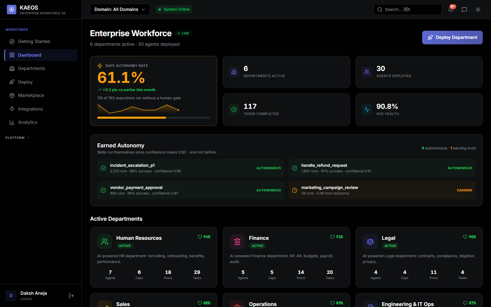

<div align="center">

# KAEOS

### The Governed AI Workforce

**It reads like chaos. It is the opposite.** KAEOS is knowledge-led, governed
autonomy: it runs real AI departments - for every function and every regulated
industry - that act on their own only when they've proven they can, with a
signed audit trail for every decision. Every action passes a 7-gate governance
pipeline, so autonomy is not granted, it is earned: the platform probes what
your model can actually do, caps every decision's confidence at that measured
ceiling, and routes anything below the bar (or high-consequence, always) to a
human. Buy one governed department, keep it because it is governed, and expand
into a living Company Brain. The number that runs it all: your safe-autonomy
rate.

> **Governed Autonomy** (the category) - **Department-as-a-Service** (what you
> buy) - **Company Brain** (what you grow into). One story, three layers.

[](LICENSE)
[](https://python.org)
[](https://nodejs.org)
[](docs/TESTING.md)
[](https://ollama.ai)

<br />



<sub>The workforce dashboard: <b>safe-autonomy rate</b> (how much ran without a human gate), live departments,
and skills that have <i>earned</i> autonomy. Captured from a running instance against PostgreSQL, a live
app on a seeded demo tenant, not a mockup or a design comp.</sub>

</div>

---

## Table of contents

- [What it is](#what-it-is)
- [The differentiator: a measured confidence ceiling](#the-differentiator-a-measured-confidence-ceiling)
- [The 7-gate pipeline](#the-7-gate-pipeline)
- [What we refuse to fake](#what-we-refuse-to-fake)
- [Quick start](#quick-start)
- [Repository layout](#repository-layout)
- [By the numbers](#by-the-numbers)
- [Documentation](#documentation)
- [Testing and CI](#testing-and-ci)
- [Known limitations](#known-limitations)
- [Contributing](#contributing)
- [License](#license)

## What it is

Enterprise agent deployments stall for a predictable reason: nobody can say,
with evidence, when an agent should be allowed to act on its own. Teams either
gate everything (and the agents save no one any time) or gate nothing (and one
bad autonomous action ends the pilot).

KAEOS starts with the **org graph**: a live model of departments, capabilities,
agents, processes, employees, vendors, projects, customers, accounts, tickets,
contracts, incidents and purchase orders, built from the tenant's own records.
That is the Company Brain. On top of it run seven pre-built AI departments (HR,
Finance, Legal, Sales, Support, Operations, Engineering & IT Ops) with 41 agents
between them, reading the real work and acting on it.

The **Neural Map** renders all of it as one living force graph: department
brains in sequence, their agents and tasks in motion above them, shared systems
bridging departments, and the knowledge core they all feed, with a per-agent
dossier (autonomy ladder, what it replaces, the SOP written out) one click away
and a drop-anything ingest bar that teaches the brain and the Copilot in the
same motion.

Everything an agent does passes the same 7-gate pipeline. Teams watch live agent
work in a shared queue and can approve, redirect or reject any of it, with
per-tenant and per-department permissions and a full audit trail. Skills
accumulate confidence from validated outcomes and lose it by decay; the
platform's headline metric is the **safe autonomy rate**, the share of
executions that ran without a human *and* completed cleanly, computed live from
real executions (`app/services/safe_autonomy.py`).

## The differentiator: a measured confidence ceiling

Bring your own model (OpenAI, Anthropic, Mistral, Groq, Cohere, self-hosted
Ollama, or any OpenAI-compatible endpoint via LiteLLM), and KAEOS **measures**
it. A probe battery covering JSON compliance, multi-step reasoning and strict
instruction following produces a `tier_ceiling`: the maximum confidence any
decision may claim on that model (`app/services/model_probe.py`).

The ceiling is enforced at **Gate 3 of the agent pipeline itself**
(`app/agents/runtime.py`), so every domain agent inherits it, not just the
`/skills` routes. A weak model mechanically routes more of the whole platform's
decisions to humans. If the ceiling lookup itself fails, the gate fails closed:
a conservative failsafe cap routes decisions to a human until it recovers. Model
choice becomes a governance dial, not a gamble.

Reproduce a ceiling on your own model:

```bash
curl -X POST http://localhost:8001/api/v1/config/llm-routing/reasoning/probe -H "X-Tenant-ID: tenant_acme"
```

Full detail, including the observed `phi4-mini` result and data-residency notes:
[docs/BYOK.md](docs/BYOK.md).

## The 7-gate pipeline

Implemented in [`backend/app/agents/runtime.py`](backend/app/agents/runtime.py).
Every department agent routes through it via its `gated_runner`.

| # | Gate | What it does | Terminal status on failure |
|---|------|--------------|----------------------------|
| 1 | **Compliance** | Runs the action's `compliance_tags` through the **deterministic statutory checker registry** (`app/compliance/`) - real rules, no LLM guess. A tag with a backing checker is judged by statute (EEOC four-fifths, SOX segregation-of-duties, ECOA, HIPAA, GDPR, OFAC, ...); a tag with **no** backing checker returns `UNBACKED` and fails closed instead of silently passing. Only frameworks with no deterministic checker fall back to a labeled LLM screen. BLOCKER stops the action; WARNINGs flow downstream into the result and provenance. | `BLOCKED_COMPLIANCE` |
| 2 | **Fairness** | Scores bias on decisions touching people. Runs *concurrently* with Gate 1 (the two are independent), with compliance verdict ordering preserved. | `BLOCKED_FAIRNESS` |
| 3 | **Confidence to HITL** | Caps the skill's confidence at the probed BYOK `tier_ceiling`; below-threshold and always-HITL actions pause for a human. Fails closed. | `PENDING_HITL` |
| 4 | **Debate** | Adversarial multi-turn challenge of the proposed decision; a contested decision gets a second turn. | routed to HITL or blocked |
| 5 | **Execution** | Runs the skill steps. Gate 5b performs governed actuation - against the external system where a write-back adapter exists (Salesforce, generic REST today), else into KAEOS's internal governed object store. | `FAILED` |
| 6 | **Audit** | Enforces post-execution audit requirements for the action's compliance tags. | `FAILED_AUDIT` |
| 7 | **Provenance** | Appends a SIGNED, hash-chained ledger record (`app/services/provenance.py`): one HMAC scheme across every writer, explicit parent pointers, per-tenant chains, appends serialized by the database so they cannot fork, and an end-to-end verifier (`/provenance/{rule}/verify`, `/provenance/stream/verify`). Entries written before the unification are reported honestly as legacy, not as tampering. | chain verification failure |

Stage timings for every gate are recorded per execution and exposed at
`GET /api/v1/metrics/latency`.

## What we refuse to fake

The honesty of the numbers is the product, so where a true number is not
measurable, the platform returns nothing rather than something invented.

- **`hours_saved` and `cost_reduction` are `null` everywhere, not estimated.**
  Both need a human-baseline duration and a loaded hourly rate per skill: tenant
  inputs KAEOS cannot observe. They were once "computed" as executions × a
  hardcoded 0.5 hours, with a hardcoded rate multiplied onto that to produce a
  cost, two fabrications stacked into a confident ROI figure with nothing behind
  it. Every surface now reports `null` with a note and a
  `hours_saved_basis` flag: the billing endpoints, the workforce analytics and
  department endpoints, and the UI, which renders "Not measured" rather than a
  bare `0h` (a measured zero and an unmeasurable one are different claims).
  A single shared contract (`hours_saved_payload`, `app/workforce/models/core.py`)
  backs all of them, and `tests/test_hours_saved_honesty.py` fails the build if
  any surface hand-rolls its own again. Migration `0030` clears the values the
  old heuristic had already persisted, so nothing stale gets re-served as though
  a tenant had supplied it. Configure a per-skill baseline and the real figures
  appear.
- **Compliance is checked by statute, not guessed by a model.** Every department
  ships **deterministic statutory checkers** (`app/compliance/`) - EEOC four-fifths,
  FLSA, I-9, SOX segregation-of-duties, ECOA/Reg B, HIPAA, GDPR/CCPA/TCPA, OFAC,
  3-way match, legal hold, and more (27 across 9 departments). The registry is
  **fail-closed**: a compliance tag with no backing checker returns `UNBACKED`
  rather than silently passing, closing the old hole where an unrecognized tag
  sailed through the gate. Checkers are pure and unit-tested; the LLM is a labeled
  fallback only where no deterministic checker exists yet.
- **The General Ledger will not post an unbalanced entry.** Finance runs real
  double-entry accrual accounting (`app/finance/services/gl.py`): debits must
  equal credits (Decimal, fail-closed), the invoice liability is accrued on
  approval, statements (trial balance, P&L, balance sheet) derive from posted
  lines, and a closed fiscal period refuses back-dated postings.
- **Benchmarks publish losses as well as wins.** On the real-data benchmark some
  domains land at or below the naive baseline, and those results are reported as
  they came out ([docs/BENCHMARKS.md](docs/BENCHMARKS.md)).
- **A simulated evaluation can never promote a model.** If a Foundry evaluation
  runs without a live provider the run is flagged `simulated` and structurally
  cannot win or be promoted.
- **There is no fake trainer.** The Foundry's weight fine-tuning step is
  external and pluggable, and the product says so.

## Quick start

Requires Docker and Docker Compose.

```bash
git clone https://github.com/Daksh-Aneja-Projects/KAEOS.git && cd KAEOS
cp .env.example .env
docker compose up --build
```

For a local trial set `DEV_MODE=true` and `ENVIRONMENT=development` in `.env`
before starting. Demo data seeds automatically on first boot
(`app/core/seed.py`); subsequent boots detect existing data and skip.

| Service | URL |
|---------|-----|
| Frontend | http://localhost:5174 |
| API + Swagger UI | http://localhost:8001/docs |
| Prometheus | http://localhost:9090 |
| Grafana | http://localhost:3000 |
| PostgreSQL | `localhost:5432` |
| Redis | `localhost:6379` |

Production mode, secrets, admin login and running against a local Ollama:
[docs/SETUP.md](docs/SETUP.md).

## Repository layout

```
KAEOS/
├── backend/                  Python 3.12 / FastAPI
│   ├── app/
│   │   ├── agents/           AgentExecutor: the 7-gate pipeline
│   │   ├── api/routes/       56 route modules, 316 endpoints
│   │   ├── connectors/       Connector base + CSV/REST adapters
│   │   ├── core/             Config, auth, RLS, tenancy, seeding, telemetry
│   │   ├── compliance/        Deterministic statutory checker spine + registry
│   │   │                      (27 checkers across 9 departments, fail-closed)
│   │   ├── models/           Platform SQLAlchemy models
│   │   ├── services/         76 domain services (gates, LLM router, provenance)
│   │   ├── workforce/        Department lifecycle, deployment, analytics
│   │   └── hr/ finance/ legal/ sales/ support/ operations/ engineering/
│   │                         7 departments, 41 agents, each behind a gated_runner
│   │                         (finance: real double-entry accrual GL + statements)
│   ├── alembic/versions/     39 migrations
│   ├── benchmark/            Real-data benchmark harness
│   └── tests/                114 files, 900 tests (441 e2e + 459 unit)
├── frontend/                 React 19 + TypeScript + Vite + Tailwind
│   └── src/                  pages + views + shared primitives (TableCard,
│                             Ring, StatCard); Compliance Checker Studio +
│                             General Ledger Workspace surfaces
├── deploy/helm/kaeos/        Helm chart
├── docs/                     Documentation (see docs/README.md)
└── docker-compose.yml        Postgres, Redis, backend, frontend, Prometheus, Grafana
```

## By the numbers

Every figure below is counted from the tracked source at the current commit and
is reproducible with the commands in [docs/TESTING.md](docs/TESTING.md).

| | |
|---|---|
| Backend | 82,517 lines of Python |
| Frontend | 32,394 lines of TypeScript / TSX |
| API surface | 316 endpoints across 56 route modules |
| Data model | 233 ORM tables across 77 model modules, 29 Alembic migrations (a created database holds 237 tables, including Alembic's own bookkeeping) |
| Departments | 7, with 41 agents (HR 7, Finance 5, Legal 5, Sales 8, Support 7, Operations 6, Engineering 3) |
| Integrations | 22 live connector adapters (5 core + 17 vendor) |
| Tests | 900 (441 end-to-end, 459 unit) across 114 files |
| UI | 99 React components: 45 pages, 18 views, 34 shared components |

## Documentation

Start at the [documentation index](docs/README.md).

| Topic | Where |
|-------|-------|
| Architecture, project structure, performance | [docs/ARCHITECTURE.md](docs/ARCHITECTURE.md) |
| Features and product tour | [docs/FEATURES.md](docs/FEATURES.md) |
| API reference | [docs/API.md](docs/API.md) |
| Integrations: 22 ingestion adapters, write-back scope, PII handling | [docs/CONNECTORS.md](docs/CONNECTORS.md) |
| Bring your own model: tiers, probes, ceiling derivation | [docs/BYOK.md](docs/BYOK.md) |
| Real-data benchmarks and methodology | [docs/BENCHMARKS.md](docs/BENCHMARKS.md) |
| Security model, multi-tenancy and RLS, SSO | [docs/SECURITY_MODEL.md](docs/SECURITY_MODEL.md) |
| Compliance posture and audit evidence | [docs/COMPLIANCE_POSTURE.md](docs/COMPLIANCE_POSTURE.md) |
| Testing: suites, CI lanes, how to run | [docs/TESTING.md](docs/TESTING.md) |
| Setup, development, environment variables | [docs/SETUP.md](docs/SETUP.md) |
| Deployment | [docs/DEPLOYMENT.md](docs/DEPLOYMENT.md) |
| Operations runbook | [docs/OPS_RUNBOOK.md](docs/OPS_RUNBOOK.md) |
| Known limitations and roadmap | [docs/KNOWN_LIMITATIONS.md](docs/KNOWN_LIMITATIONS.md) |
| Reporting a vulnerability | [SECURITY.md](SECURITY.md) |

## Testing and CI

```bash
cd backend && python -m pytest tests --ignore=tests/e2e   # 459 unit tests
cd backend && python -m pytest tests/e2e                  # 441 e2e tests
cd frontend && npm run lint && npm run build && npm test   # lint, build, Vitest
```

[`.github/workflows/ci.yml`](.github/workflows/ci.yml) runs six lanes on every
push and pull request:

| Lane | What it does |
|------|--------------|
| `backend-lint` | Ruff, bug-catching rule set (`backend/ruff.toml`) |
| `backend-test` | Unit suite on Python 3.12, under a coverage floor (`--cov-fail-under=58`) |
| `e2e` | Boots the backend, seeds, runs the non-Ollama e2e suite against PostgreSQL + pgvector |
| `frontend-build` | ESLint, production build, Vitest |
| `security-scan` | `pip-audit` (CVEs), `bandit` (medium+, blocking), `npm audit` (high+) |
| `sbom` | CycloneDX Software Bill of Materials for both dependency trees, uploaded as a build artifact |

Details, including the Ollama-dependent lane: [docs/TESTING.md](docs/TESTING.md).

## Known limitations

We would rather you read this from us than find it. KAEOS is not independently
certified (SOC 2, ISO 27001, HIPAA); certification is a third-party audit
software cannot self-grant, so what ships is audit-readiness evidence
(`GET /api/v1/compliance/controls`), not a certificate. The Foundry orchestrates
fine-tuning but does not run the weight-training step. Prompt-injection has a
real detection-and-neutralization layer wired into ingestion, but it is defense
in depth, not a solution. Simulation surfaces are parameterized archetypes,
labelled as such, not models learned from your data. Neo4j and the LangChain
semantic-chunking backends are optional and imported lazily; the default
deployment runs without them. The full list, kept current:
[docs/KNOWN_LIMITATIONS.md](docs/KNOWN_LIMITATIONS.md).

## Contributing

Read [CONTRIBUTING.md](CONTRIBUTING.md) before opening a pull request. We follow
the [Contributor Covenant Code of Conduct](CODE_OF_CONDUCT.md). Contributions
are inbound = outbound under Apache 2.0; there is no CLA to sign.

## License

**All KAEOS source code is licensed under the Apache License 2.0, and only that.**
There is no dual license, no commercial license tier, and no proprietary or
"all rights reserved" grant anywhere in this repository. See [LICENSE](LICENSE)
for the full text and [NOTICE](NOTICE) for required attributions.

**Everything needed to run KAEOS is in this repository.** No feature is gated
behind a paid tier, no proprietary component is required to stand the platform
up, and there is no licence check or usage telemetry reporting back to anyone.
The platform ships with no analytics SDK; the only outbound observability is
OpenTelemetry tracing, which stays off unless you set
`OTEL_EXPORTER_OTLP_ENDPOINT` to a collector **you** run.

Apache 2.0 grants commercial use, modification, distribution and patent rights.
It requires that you preserve the copyright and NOTICE attributions and state
significant changes.

What the Apache grant does **not** cover:

| Not covered | Why |
|-------------|-----|
| Benchmark datasets under `backend/data/kaggle_raw/` | Third-party data, gitignored and not distributed here. Each carries its own license from its publisher, recorded in [NOTICE](NOTICE) and in `DATASET_MANIFEST` (`backend/benchmark/real_data/loaders.py`). The CUAD v1 corpus is a work of The Atticus Project under CC BY 4.0. |
| Third-party dependencies | Declared in `backend/requirements.txt` and `frontend/package.json`, each under its own license. The small number carrying weak file-level copyleft (psycopg2-binary, certifi, tqdm, lightningcss) are used unmodified, which their licenses permit inside an Apache 2.0 distribution. Itemized in [NOTICE](NOTICE). |
| The "KAEOS" name and logo | Trademark rights are not granted by Apache 2.0 §6. You may run, modify and redistribute the code; naming your distribution "KAEOS" is a separate question. |
| Data your deployment produces | Autonomy thresholds the governor learns, execution history, provenance ledger entries and audit records are generated by *your* instance from *your* operations. They are your data, they never leave your deployment, and they were never part of this repository. The tuning constants visible in `backend/app/services/autonomy_governor.py` are starting defaults, not the values your deployment converges on. |

> **A note on the word "IP" in this codebase.** `backend/app/legal/agents/ip_agent.py`,
> `backend/app/legal/models/ip.py` and the "IP/patent evaluation" feature refer to
> a *Legal department capability* that helps a tenant track **their own**
> intellectual property. They are product features, not a license claim on KAEOS
> itself. KAEOS remains Apache 2.0.

---

<div align="center">

**Cofounders:** Daksh Aneja (Product and Engineering) and Sathya Sankarasubbu
(Sales and Marketing). Built with **Claude** (Anthropic's AI coding tools) as the
AI engineering assistant, across architecture, implementation, security
hardening and verification. Human-directed and AI-built, and deliberately honest
about what is shipped versus roadmap
([docs/KNOWN_LIMITATIONS.md](docs/KNOWN_LIMITATIONS.md)).

**Built with** FastAPI · SQLAlchemy · LiteLLM · React · TypeScript · Redis · PostgreSQL + pgvector · Ollama
<br /><sub>Neo4j and LangChain text-splitters are optional backends, imported lazily.</sub>

</div>
