# Features & Product Tour

Back to the [README](../README.md). Related: [Architecture](ARCHITECTURE.md) |
[API reference](API.md) | [BYOK](BYOK.md) | [Benchmarks](BENCHMARKS.md)

## 7 AI-Powered Departments

Deploy any combination of these pre-built AI departments, built on a production-oriented,
security-hardened architecture (RLS-isolated per tenant, gated agent pipeline). Agent counts
are the agent modules under `backend/app/<department>/agents/`, 41 in total.

| Department | Agents | Key Automations |
|-----------|--------|-----------------|
| **Human Resources** | 7 | Recruiting pipeline, onboarding, benefits Q&A, performance synthesis, compensation analysis, employee relations, offboarding |
| **Finance** | 5 | AP/AR processing, budget variance analysis, expense review, payroll audit, tax compliance |
| **Legal** | 5 | Contract review, regulatory compliance monitoring, litigation tracking, privacy impact assessment, IP/patent evaluation |
| **Sales** | 8 | Pipeline coaching, lead scoring, deal forecasting, account health, churn risk, CPQ discounting, proposal generation, commission payout |
| **Customer Support** | 7 | Ticket triage, auto-resolution, SLA enforcement, knowledge base retrieval, resolution drafting, escalation routing, CSAT analysis |
| **Operations** | 6 | Project tracking, resource allocation, vendor management, procurement workflows, facilities, QA automation |
| **Engineering & IT Ops** | 3 | Code review risk assessment, incident triage with deploy correlation, deployment risk scoring |

**Why Engineering matters most.** Coding is ~55% of enterprise departmental AI spend and IT ops
another ~10% ([Menlo Ventures, 2025 State of GenAI in the Enterprise](https://menlovc.com/perspective/2025-the-state-of-generative-ai-in-the-enterprise/),
survey of 495 enterprise AI decision-makers) - more than every other function combined. The
Engineering department models the service catalog (SLO targets, error budgets, ownership), pull
requests, deployments, incidents, and postmortems, and reports live DORA metrics (change-failure
rate, MTTR) computed from real rows.

Two behaviours are deliberate and enforced by tests:

- **Production deploys never self-approve.** `engineering_deploy_approval` is an always-HITL skill:
  the agent scores risk and produces the evidence, a human approves the release.
- **Incidents may only be blamed on deploys that actually shipped** and that precede detection.
  Without both filters an agent will confidently tell a commander to roll back a release that was
  never deployed.

## 7-Gate Skill Execution Pipeline

Every AI action - regardless of source - is evaluated by the same 7-gate pipeline before execution.
Autonomy is the default: a decision whose confidence clears the threshold passes straight through the
HITL gate and executes without a human. The gate only pauses decisions below the threshold and a set of
high-consequence action classes (e.g. production deploys, customer-facing documents), which always route
to a human:

```
Signal / Trigger
      |
      v
  1. Compliance      <- SOX, GDPR, HIPAA, PCI, EEOC, CCPA enforcement
      |
      v
  2. Fairness        <- Statistical 4/5ths disparate-impact test on cohort outcomes; LLM screening (labeled) when no cohort data
      |
      v
  3. Confidence      <- Threshold check, AMBER/GREEN/RED tier routing
      |
      v
  4. HITL            <- Below-threshold + high-consequence actions pause here;
      |                 above-threshold decisions pass through autonomously
      |
      v
  5. Debate          <- Adversarial Proposer / Advocate / Arbitrator reasoning
      |
      v
  6. Execute         <- LLM execution via tiered BYOK routing (local Ollama or cloud via LiteLLM)
      |
      v
  7. Provenance      <- Hash-chained, append-only decision ledger with full lineage
```

The gates live in `backend/app/agents/runtime.py` (`AgentExecutor`);
`backend/app/services/skill_executor.py` runs the skill's steps after the gates clear.

## Safe Autonomy Rate - the metric that matters

Industry data is brutal: only **16%** of enterprise agent deployments are true autonomous agents,
**88%** of agent pilots never reach production, and Gartner projects **>40%** of agentic AI projects
will be cancelled by end-2027. In that market the question isn't "can your agent do the task" - it's
"does your agent survive contact with production."

So KAEOS measures **safe autonomy rate**: the share of work completed without human intervention, at
a fixed error budget, trending over time. It is computed live from real executions - a headline number
at `GET /billing/roi`, and a fully broken-out view at `GET /metrics/safe-autonomy` (the rate, an
explainable fallout breakdown of routed-to-human / overridden / edited / failed, a per-skill split
showing where autonomy leaks, and a daily time-series). It rises as verified rules accumulate - the
compounding loop in one number. In the app the **Dashboard** surfaces the rate, its trend, the
earned-autonomy skills, and the fallout breakdown (where autonomy fell out) - all in one place, live.
The loop closes under **Decisions -> Feedback & Evolution**, where an **Outcome Intelligence** panel
records how past decisions actually turned out (GOOD/NEUTRAL/BAD). Each mark feeds back into the
executing skill's confidence and splits real-world quality by autonomous-vs-human, so autonomy is
earned against reality, not only against labels at decision time (`GET /outcomes/impact`).

## Missions - autonomy that pursues goals

Autonomy that only pursues tasks is a tool; autonomy that pursues **goals** is an operating system.
**Mission Control** (Agents view) turns a plain-language goal into a governed plan across departments:
each step is grounded in a real skill, runs through the 7 gates on the live model, routes
high-consequence departments to a human checkpoint, respects a budget, and streams a mission ledger.
Autonomous steps run on their own; the ones that need you pause for approval.

## Actions Ledger - autonomy that acts

Autonomy that only recommends is a demo; autonomy that **acts** is the product. The **Actions Ledger**
(Decisions, beside the provenance ledger) records every governed write KAEOS made - idempotent on
retry, reversible via a compensator, and provenance-chained. Honest scope: **external** write-back
reaches Salesforce and any generic REST sink today; other connectors are ingestion-only for now, and
governed writes to those targets land in KAEOS's internal governed object store until their write-back
adapters ship (see [Known Limitations](KNOWN_LIMITATIONS.md)). Agents actuate through **Gate 5b**, so a
write only fires after the compliance / fairness / HITL / debate gates pass - and the direct
`/actuation` API enforces the same consequence gate: high-consequence writes pause for human approval.
A drift monitor reconciles the actuated store against the actions that governed it
(`GET /actuation/ledger`, `/actuation/drift`).

## KAEOS Copilot - always-on conversational touchpoint

Every screen carries a persistent copilot dock in the bottom-right corner. Any
authenticated user can open it and ask, in plain language, about their agents,
rules, skills, deployments, or compliance posture. It streams grounded answers
from the platform (never fabricated data) and is read-only, so it is available to
every role. Auth is carried on the user's session token; responses stream over
Server-Sent Events.

## KAEOS speaks agent - MCP endpoint + Company Skills File

Enterprises do not just need AI that works for humans; they need their existing AI
agents to act safely. KAEOS exposes a machine-facing interface for exactly that:

- **MCP endpoint** (`POST /mcp`, JSON-RPC 2.0 over streamable HTTP): any
  MCP-speaking agent - Claude, or anything else that talks the protocol - can
  `initialize`, discover the tool catalog, and call six governed tools:
  `query_company_brain`, `list_skills`, `execute_skill`,
  `get_safe_autonomy_rate`, `list_pending_approvals`, `export_skills_file`.
- **The gates still apply.** The MCP layer is a thin protocol adapter that
  forwards in-process to the same governed routes a human hits - identical
  7-gate pipeline, RBAC, and tenant isolation. An agent executing a
  high-consequence skill gets `PENDING_HITL` and waits for a human, exactly
  like everyone else. There is no side door.
- **Company Skills File** (`GET /brain/skills-file`): the tenant's Company
  Brain - operating rules and executable skills with confidence tiers and
  compliance tags - exported as one portable, agent-ready document (markdown
  for context windows, JSON for programs). Knowledge as an executable artifact,
  not a chatbot.

Verified end to end by `tests/e2e/test_30_agent_interface.py`, including a real
skill execution through MCP on a live local model.

## Agent Factory

Build and deploy custom AI agents from natural language:

```
Prompt -> Blueprint (DRAFTING) -> Approval (APPROVED) -> Compile (COMPILED) -> Deploy (RUNNING)
```

- Write a plain-English description of what the agent should do
- The system generates a structured blueprint using your org's rules and capabilities
- Approve, compile (LLM-powered code generation), and deploy with one click
- Deployed agents appear in the live workforce with full observability

## AI Foundry - curating governed activity into training datasets

Phase 2 live; Phase 3 evaluation + gated promotion live; weight fine-tuning is roadmap.

KAEOS today is a Company Brain: it understands, reasons over, and acts on enterprise knowledge, and
learns by memory - every conversation adds context, but the underlying model never changes. The
Foundry goes further: the Company Brain becomes a **factory for AI models**, turning the enterprise's
own governed activity into training data, then (in later phases) fine-tuned, evaluated, and safely
deployed specialist models.

**Phase 2 - Learning Intelligence - is live today** (`/platform/foundry`):

- Every governed decision an agent makes is already a `SkillExecution` - instruction, grounding
  context, reasoning chain, outcome, and human approval. The Foundry curates that history into an
  exportable `{instruction, context, ideal_answer, reasoning, evaluation}` training set.
- Examples are scored by training-signal strength: **Corrected** (a human edited the answer - the
  strongest supervised signal) > **Approved** (a human OK'd it at a gate) > **Gold** (a clean success
  trusted without a human) > **Negative** (blocked/rejected - a contrastive example).
- **Human feedback capture** on any decision (Yes / No / Suggest correction) records the one signal
  executions do not already store: the answer an expert would have preferred.
- Because every example is derived from a governed execution, nothing blocked at the compliance gate,
  or rejected by a human, ever becomes training data - the dataset inherits the platform's governance.
- One-click **Build Dataset** (idempotent mining) and **Export JSONL** ready for the Phase 3
  fine-tuning pipeline. Everything is tenant-scoped and RLS-isolated.

**Phase 3 - Model Evolution - the evaluation-and-gated-promotion loop is live** (`/foundry/evolution/*`):

- Bring a **candidate** model (a stronger model, or one fine-tuned externally on the Phase-2 export)
  and KAEOS **measures** it against the tenant's current model on a **held-out slice of that tenant's
  own governed examples** - real generations, deterministic scoring (exact-match + token-F1), a
  reproducible hashed eval set. No LLM-judges-itself, no invented numbers.
- If evaluation runs **without a live provider**, the run is flagged `simulated` and **can never win
  or be promoted** - a fabricated score must never drive a model swap.
- A win is recorded but **never auto-applied**. Promotion is a separate, **admin-gated** action that
  rewrites the tenant's BYOK routing and forces a re-probe, so the confidence-ceiling gate re-derives
  itself for the new model - the same gated-deploy discipline the rest of the platform uses.
- **What Phase 3 deliberately does NOT do:** train weights. The actual fine-tune step is
  external/pluggable (submit the JSONL to a provider, bring the resulting model id back as the
  candidate). Shipping a fake trainer would violate the platform's honesty, so it is absent by design.
  Verified by `tests/test_model_evolution.py`.

The five-phase roadmap (1: Company Brain - done; 2: Learning Intelligence - live; 3: Model Evolution -
evaluation + gated promotion live, weight training external/roadmap; 4: Specialized Models;
5: Autonomous Foundry) is shown honestly in-product, and every future model
stays gated by the same 7-gate evaluation, safety checks, and human oversight before deployment.

## Client Onboarding - provision a tenant, hand off a secure login

A guided, frontend-driven flow stands up a new client entirely through the product:

- **Admin control tower + wizard** (`/platform/onboarding`, admin-only): a platform operator enters
  the admin secret (held only in the browser tab, sent as a header, never stored), provisions a new
  tenant, and creates its first admin login, ending in a one-time secure handoff card (sign-in URL,
  admin email, temporary password, tenant id). The operator only provisions and creates the first
  login - the client self-serves everything else, so the operator never touches client data (RLS
  enforces it).
- **Client Getting Started** (`/getting-started`): the new client signs in and follows a live
  checklist computed from real tenant state - connect a data source, deploy a department, run a first
  governed decision, configure their model, invite their team, and watch their AI training dataset
  grow.

## Foresight - the machine picks the question

Shock, What-if, Wargame and Replay are reactive: you pose a premise and watch the twin respond,
which assumes you already know what to ask. Foresight inverts that. With no prompt it sweeps the
whole shock catalogue against the live twin and scores every scenario
`exposure = likelihood x blast_radius x preparedness_gap` - likelihood weighted by your own signals
and prior shock outcomes, blast radius a real traversal from the worst credible entry point, and the
gap 1.0 when nothing governs the scenario. What comes back is a ranked board of **Inevitable
Surprises**: the threats you have no governed answer to. One click drafts a mission to close the gap,
in `PLANNING` for a human to approve. The second lane projects what KAEOS will do autonomously over
30/60/90 days, the safe-autonomy north star, and exactly where it will still need you.
All three factors are shown per scenario, so the score is never a black box.

## Screenshots

All captured from a running instance against PostgreSQL - a live app on a seeded demo tenant.

### Reality Experience - live enterprise twin, shock simulation, decision provenance
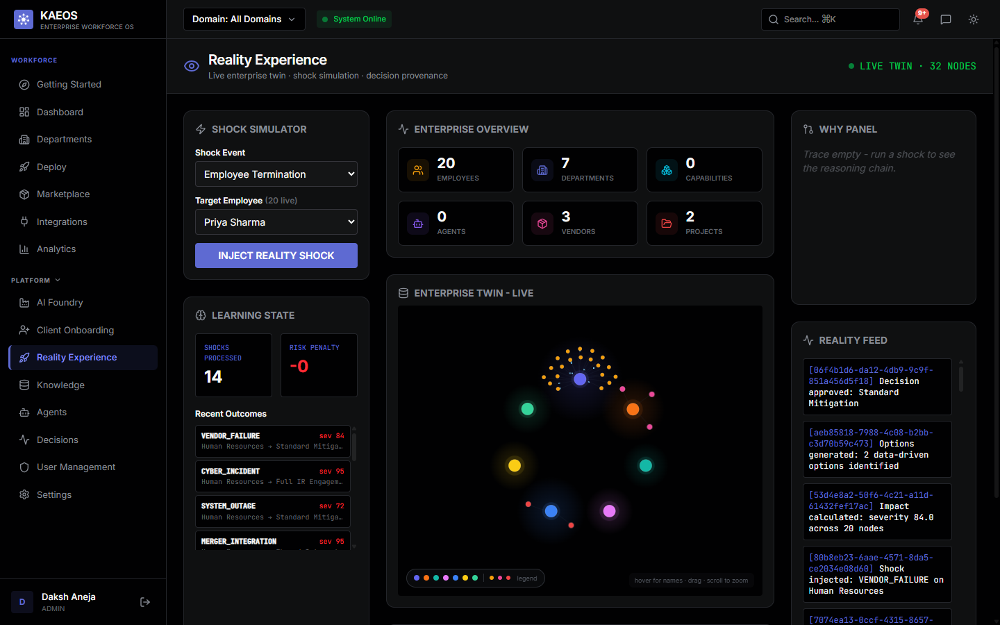
<sub>Inject a shock (termination, vendor failure, cyber incident) and watch it propagate across the live
twin, with the reasoning chain and a provenance feed of every decision.</sub>

### AI Foundry - and an honest roadmap, shown in-product
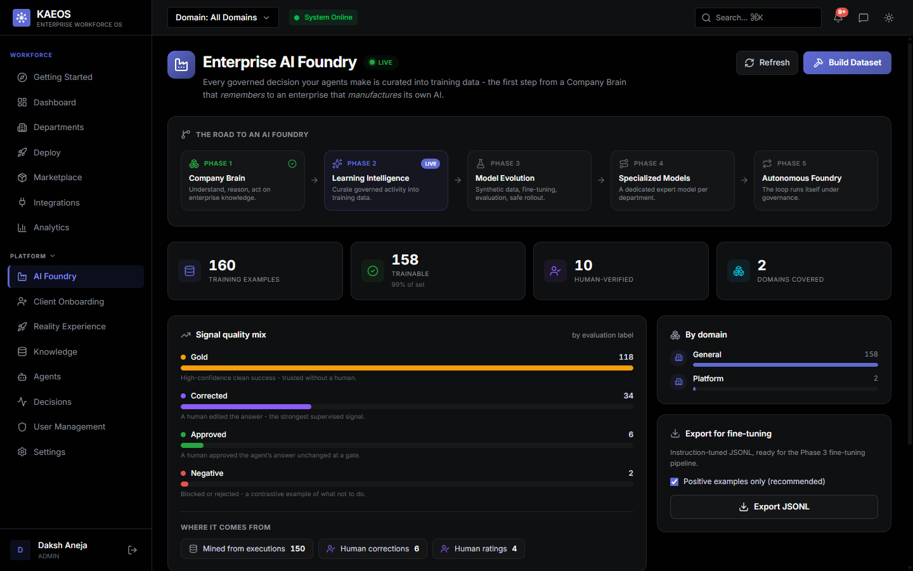
<sub>Governed decisions are curated into training data. Note the phase strip: **Phase 2 is LIVE**;
model fine-tuning (Phase 3+) is roadmap and the product says so. Signal quality is broken out by
how each example was earned - gold, human-corrected, approved, or negative.</sub>

### Executive Cockpit - governance in motion
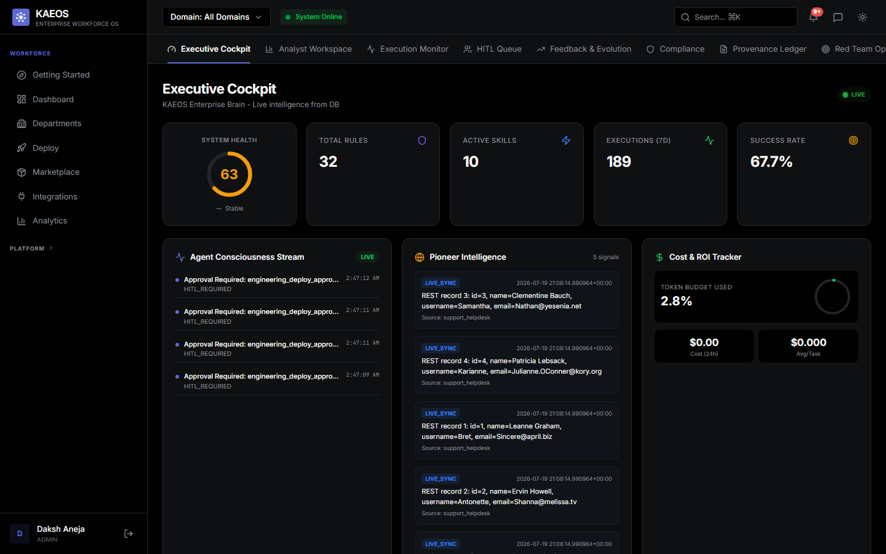
<sub>System health, rules, executions and success rate - with the agent stream showing
`HITL_REQUIRED` approvals: agents that hit the confidence gate and stopped for a human.</sub>

### Skills Registry - confidence, decay, and compliance tags
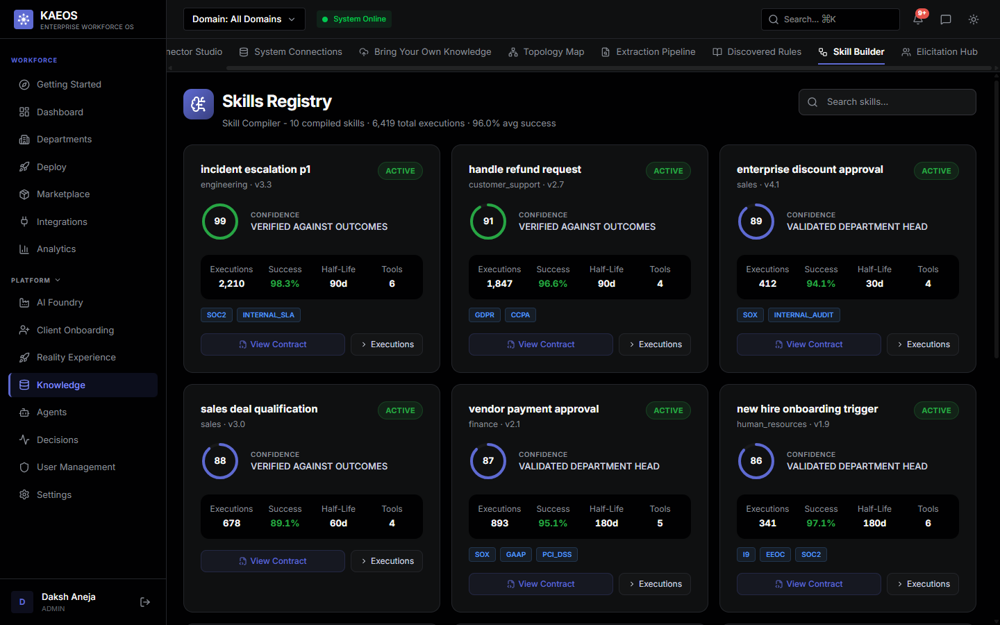
<sub>Every compiled skill carries a confidence score, how it was validated, a half-life (confidence
decays), the tools it may call, and its compliance tags (SOC2, GDPR, SOX, PCI-DSS...).</sub>

### Knowledge Graph - how every workflow connects to the rules that govern it
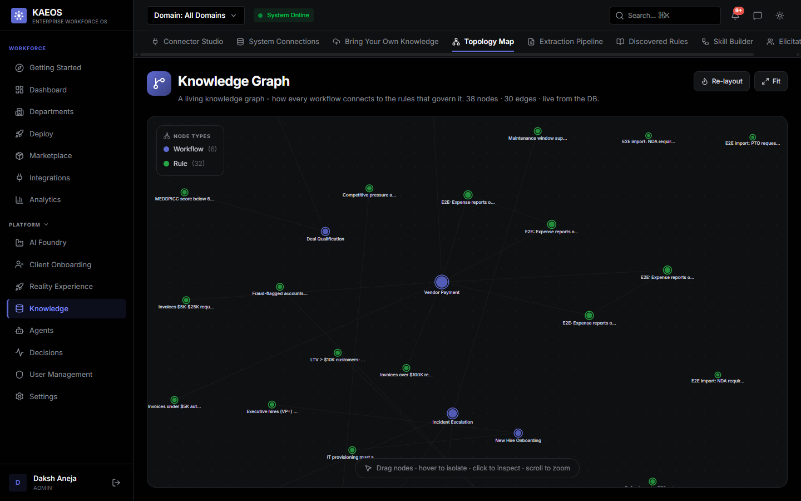
<sub>Live from the database: workflows wired to the rules that constrain them - the cross-domain
graph the Company Brain reasons over.</sub>

### Knowledge Capture - eliciting the unwritten rules
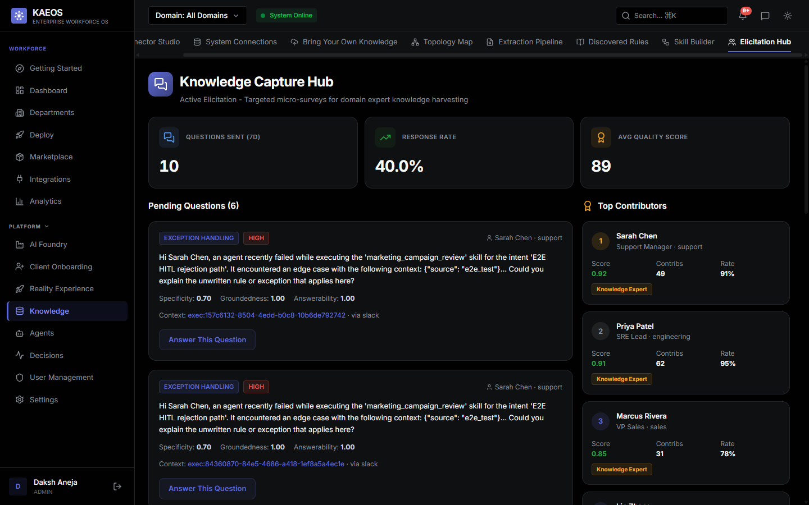
<sub>When an agent hits an edge case, KAEOS asks the right human a targeted question and folds the
answer back into the Company Brain - scored for specificity, groundedness and answerability.</sub>

### Pre-built connectors - 22 live ingestion adapters
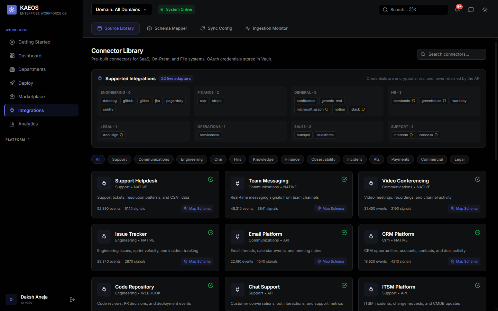
<sub>Ingestion connectors across Engineering, Finance, HR, Legal, Sales, Support and Operations.
Write-back to the external system currently ships for Salesforce and generic REST; the rest are
read/sync-only and say so at runtime. Credentials are encrypted at rest and never returned by the
API.</sub>

### The seven AI departments
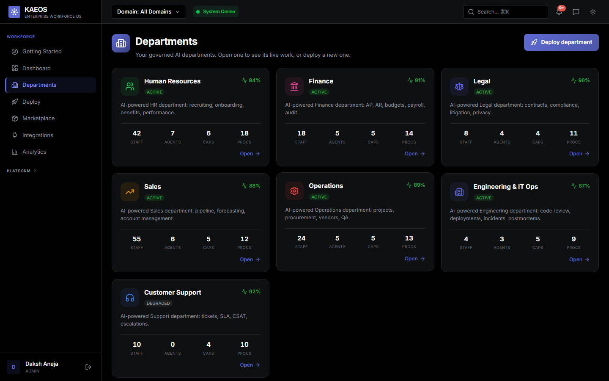

### Department-as-a-Service - deploy a governed department in four steps
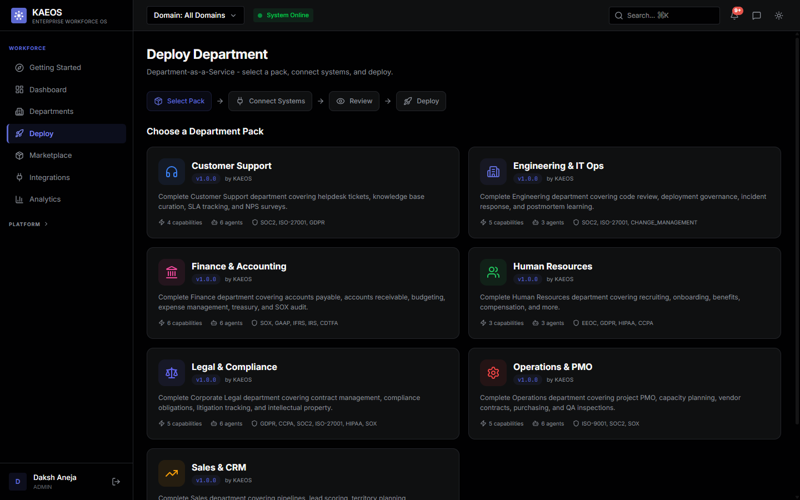
<sub>Pick a pack, connect systems, review, deploy. Each pack ships its capabilities, agents, and the
compliance frameworks it's built against (SOX, GDPR, HIPAA, ISO-27001, EEOC...).</sub>

### Department depth - Finance
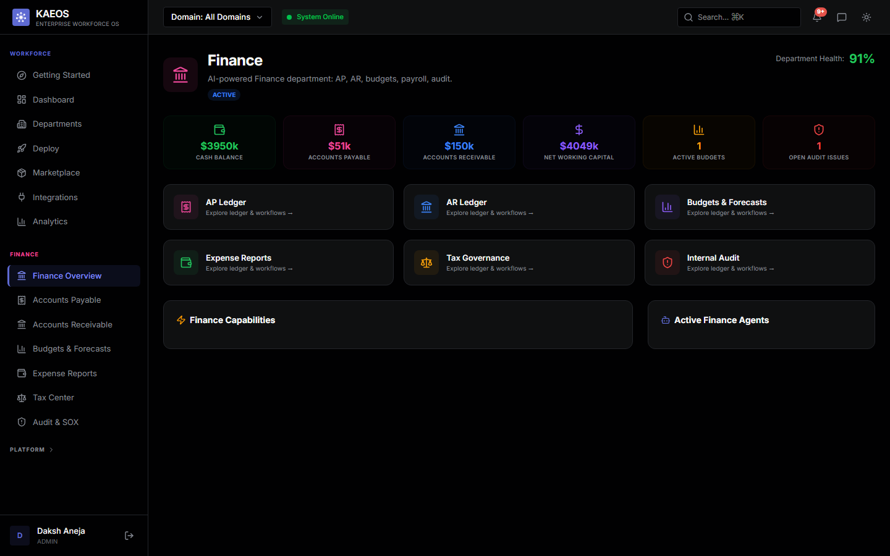
<sub>Each department has its own ledgers, workflows and agents; the sidebar expands into the
department's own sub-navigation.</sub>

### Agent Factory - build an agent from plain language
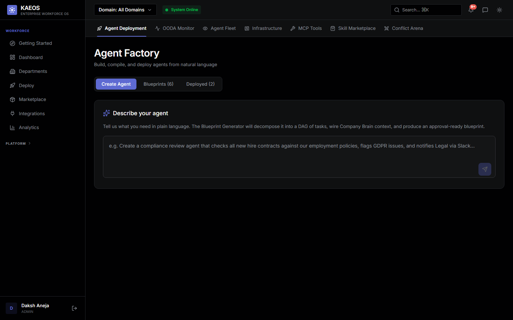
<sub>Describe what you need; the Blueprint Generator decomposes it into a task DAG, wires Company
Brain context, and produces an approval-ready blueprint.</sub>

### Getting started
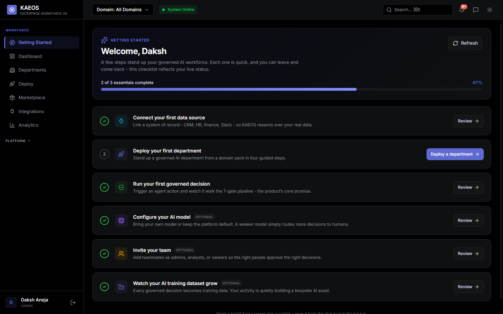
